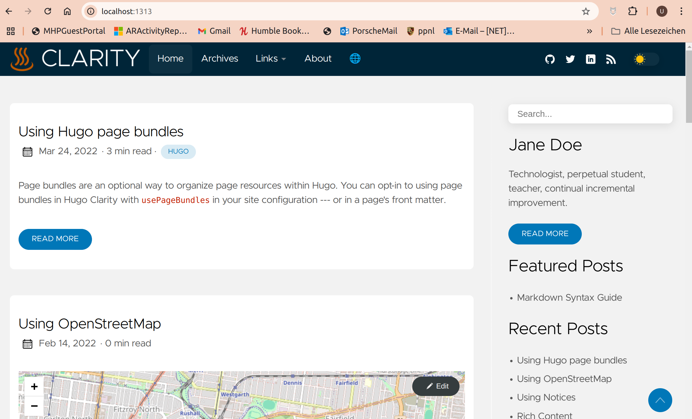

+++
date = '2024-12-22'
draft = false
title = 'Hugo: Neustart mit dem Theme Clarity'
categories = [ 'Hugo' ]
tags = [ 'hugo', 'clarity' ]
+++

<!--
Hugo: Neustart mit dem Theme Clarity
================================
-->

Der Versuch der Umstellung auf das Theme "Clarity" ist vor ein
paar Tagen gescheitert. Details stehen hier:
[Hugo: Kurztest vom Theme Clarity]().

Jetzt experimentiere ich nochmal mit "Clarity" indem ich
von Grund auf damit starte und meine Artikel reinkopiere.
Mal sehen, wie's klappt!

<!--more-->

Neue Hugo-Seite anlegen
-----------------------

```
cd /tmp
hugo new site new-site
cd new-site
```

Clarity Theme herunterladen
---------------------------

```
cd /tmp/new-site
git clone --depth=1 https://github.com/chipzoller/hugo-clarity themes/hugo-clarity
rm -rf themes/hugo-clarity/.git
```

Erstsichtung
------------

```
cd /tmp/new-site
cd themes/hugo-clarity/exampleSite
hugo server --themesDir ../..
```

Dann im Browser: [http://localhost:1313](http://localhost:1313)
Sieht richtig gut aus!



Aufbau der neuen Webseite
-------------------------

```
cd /tmp/new-site
cp -a themes/hugo-clarity/exampleSite/config config
cp -a themes/hugo-clarity/exampleSite/layouts/. layouts/.
cp -a themes/hugo-clarity/exampleSite/static/. static/.
cp -a themes/hugo-clarity/exampleSite/content/. content/.
#
# hugo.toml und config.toml sichten und ggf. übernehmen
# nach config/_default/hugo.toml
#
rm -f hugo.toml config.toml
hugo server
```

Dann im Browser: [http://localhost:1313](http://localhost:1313)
Sieht richtig gut aus (wie zuvor)!

Eigene Inhalte kopieren
-----------------------

Irrweg!

```
cd /tmp/new-site
MY_HUGO=$HOME/private/uli.heller.cool/my-hugo-site
cp -a "${MY_HUGO}/content/." content/.
hugo server
```

Es erscheinen sehr viele Fehlermeldungen:

```
uli@uliip5:/tmp/new-site$ hugo server
Watching for changes in /tmp/new-site/{archetypes,assets,content,data,i18n,layouts,static,themes}
Watching for config changes in /tmp/new-site/config/_default, /tmp/new-site/config/_default/menus
Start building sites … 
hugo v0.136.5-46cccb021bc6425455f4eec093f5cc4a32f1d12c+extended linux/amd64 BuildDate=2024-10-24T12:26:27Z VendorInfo=gohugoio

ERROR render of "term" failed: "/tmp/new-site/themes/hugo-clarity/layouts/_default/list.html:2:6": execute of template failed: template: _default/list.html:2:6: executing "main" at <partial "archive" .>: error calling partial: "/tmp/new-site/themes/hugo-clarity/layouts/partials/archive.html:16:11": execute of template failed: template: partials/archive.html:16:11: executing "partials/archive.html" at <partial "excerpt" .>: error calling partial: execute of template failed: template: partials/excerpt.html:12:12: executing "partials/excerpt.html" at <partial "image" (dict "file" . "alt" $.Title "type" "thumbnail" "Page" $.Page)>: error calling partial: "/tmp/new-site/themes/hugo-clarity/layouts/partials/image.html:29:14": execute of template failed: template: partials/image.html:29:14: executing "partials/image.html" at <strings.HasPrefix>: error calling HasPrefix: unable to cast maps.Params{"src":"img/placeholder.png", "visibility":[]interface {}{"list"}} of type maps.Params to string
ERROR render of "section" failed: "/tmp/new-site/themes/hugo-clarity/layouts/_default/list.html:2:6": execute of template failed: template: _default/list.html:2:6: executing "main" at <partial "archive" .>: error calling partial: "/tmp/new-site/themes/hugo-clarity/layouts/partials/archive.html:16:11": execute of template failed: template: partials/archive.html:16:11: executing "partials/archive.html" at <partial "excerpt" .>: error calling partial: execute of template failed: template: partials/excerpt.html:12:12: executing "partials/excerpt.html" at <partial "image" (dict "file" . "alt" $.Title "type" "thumbnail" "Page" $.Page)>: error calling partial: "/tmp/new-site/themes/hugo-clarity/layouts/partials/image.html:29:14": execute of template failed: template: partials/image.html:29:14: executing "partials/image.html" at <strings.HasPrefix>: error calling HasPrefix: unable to cast maps.Params{"src":"img/placeholder.png", "visibility":[]interface {}{"list"}} of type maps.Params to string
Built in 900 ms
Error: error building site: render: failed to render pages: render of "page" failed: "/tmp/new-site/themes/hugo-clarity/layouts/_default/baseof.html:21:8": execute of template failed: template: _default/single.html:21:8: executing "_default/single.html" at <partial "head" .>: error calling partial: "/tmp/new-site/themes/hugo-clarity/layouts/partials/head.html:24:4": execute of template failed: template: partials/head.html:24:4: executing "partials/head.html" at <partial "opengraph" .>: error calling partial: "/tmp/new-site/themes/hugo-clarity/layouts/partials/opengraph.html:37:21": execute of template failed: template: partials/opengraph.html:37:21: executing "partials/opengraph.html" at <add $relpath .>: error calling add: can't apply the operator to the values
```

Einzelne Seite kopieren
-----------------------

```
cd /tmp/new-site
rm -rf content
mkdir content
cp -a themes/hugo-clarity/exampleSite/content/. content/.
hugo server
# Klappt wieder - Strg-C

MY_HUGO=$HOME/private/uli.heller.cool/my-hugo-site
cp $MY_HUGO/content/blog/2024-11-20_start-mit-hugo.md content/post
hugo server
# Klappt! - Strg-C

cp $MY_HUGO/content/blog/*.md content/post
hugo server
# Klappt! - Strg-C

mkdir content/blog
cp $MY_HUGO/content/blog/*.md content/blog
hugo server
# Klappt! - Strg-C
rm -rf content/blog

cp -a $MY_HUGO/content/blog/2024-11-22_hugo-mainroad-breite content/post/.
hugo server
# Klappt! Es fehlen aber die Bilder im neu kopierten Artikel - Strg-C
```

Fehlende Bilder bei PageBundles
-------------------------------

Laut [Clarity - Organizing page resources](https://github.com/chipzoller/hugo-clarity#organizing-page-resources)
soll der Parameter `usePageBundles=true` dafür sorgen, dass die Bilder angezeigt werden.
Das habe ich ausprobiert an verschiedenen Stellen:

- Im Parameter-Bereich der Seite: Klappt!
- config/_default/hugo.toml: Klappt nicht
- config/hugo.toml: Klappt nicht
- hugo.toml: Klappt nicht
- config/_defaults/params.toml: Klappt
- config/_defaults/params.toml kopieren nach config/params.toml und dort anpassen: Klappt nicht!

Links
-----

- [Github - Hugo-Clarity](https://github.com/chipzoller/hugo-clarity)
- [Getting Up And Running](https://github.com/chipzoller/hugo-clarity?tab=readme-ov-file#getting-up-and-running)
- [Clarity - Organizing page resources](https://github.com/chipzoller/hugo-clarity#organizing-page-resources)
- [Hugo: Kurztest vom Theme Clarity]()

Historie
--------

- 2024-12-22: Erste Version
