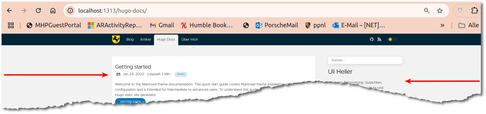
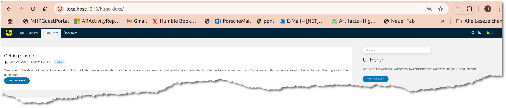

+++
date = '2025-01-05'
draft = false
title = 'Hugo-Clarity: Diverse Kleinprobleme'
categories = [ 'Hugo' ]
tags = [ 'hugo', 'clarity' ]
toc = true
+++

<!--
Hugo-Clarity: Diverse Kleinprobleme
===================================
-->

Hier beschreibe ich die Korrektur von
diversen Kleinproblemen, die mir bei
dem Theme "Clarity" aufgefallen sind.
Diese (und auch andere)
habe ich aufgelistet in [Störende Details bei Hugo]()

<!--more-->

Clarity: Aktiven Eintrag im Menü markieren
------------------------------------------

### TLDR

- Hintergrundfarbe aktives Menu:
  - themes/hugo-clarity/assets/sass/_components.sass
  - `&_active` - `background-color` - `var(--choice-bg)`
- Textfarbe aktives Menu:
  - themes/hugo-clarity/assets/sass/_components.sass
  - `&_active` - `color` - `var(--text)`
- Abstand - nav_parent nav_active
  - themes/hugo-clarity/assets/sass/_components.sass
  - `&_parent` - `margin` - `0.25rem 0 0 0`
- Rundung
  - themes/hugo-clarity/assets/sass/_components.sass
  - `&_parent` - `border-radius` - `0.5rem 0.5rem 0 0`


Dark

- Neue Variablen in "themes/hugo-clarity/assets/sass/_variables.sass":
  - --nav-bg: var(--bg)
  - --nav-text: var(--haze)
  - --nav-active-bg: var(--choice-bg)
  - --nav-active-text: var(--text)
- Werte für "dark":
  - --nav-bg: #0077b8 (TBD: Variable)
  - --nav-text: var(--haze) (TBD: notwendig?)
  - --nav-active-bg: var(--choice-bg) (TBD: notwendig?)
  - --nav-active-text: var(--text) (TBD: notwendig?)
- Werte setzen in "themes/hugo-clarity/assets/sass/_components.sass":
  - .nav - background-color
  - .nav - color
  - .nav &active - background-color
  - .nav &active - color
  - .nav &header - background-color


### Detailanalyse - Hintergrundfarbe

"Eigentlich" ist das gar kein Problem. Der aktive Eintrag
ist markiert. Ich konnte ihn zumindest auf meinem Laptop
einfach nicht richtig erkennen:


Sichtung: Welche ColorCodes werden verwendet?

- Markierter Eintrag: #0d3042
- Menü: #002538

Tauchen diese ColorCodes im Thema Clarity auf?

- `find themes/hugo-clarity -type f|xargs grep -l '#0d3042'` -> nicht gefunden
- `find themes/hugo-clarity -type f|xargs grep -l '#002538'` -> themes/hugo-clarity/assets/sass/_variables.sass

Detailsichtung: Landet in Variable "bg". Führt leider nicht wirklich weiter!

Wo wird "menu" verwendet?

- `find themes/hugo-clarity -type f|xargs grep -l menu` -> u.a. "_components.sass"

Sichtung/Anpassung "_components.sass"

```diff
diff --git a/themes/hugo-clarity/assets/sass/_components.sass b/themes/hugo-clarity/assets/sass/_components.sass
index 59e784b..b688061 100644
--- a/themes/hugo-clarity/assets/sass/_components.sass
+++ b/themes/hugo-clarity/assets/sass/_components.sass
@@ -11,7 +11,7 @@
   justify-content: space-between
   @include content
   &_active
-    background-color: rgba($light, 0.05)
+    background-color: $haze //rgba($light, 0.05)
     border-radius: 0.25rem
   &, &_body
   &_icon
```

Damit:


Klar, so kann es nicht bleiben! Man kann die Beschriftung nicht erkennen.
Außerdem stört der "Abstand". Und bei Umstellung auf "Dark" sieht es ganz
finster aus!

Clarity: Breite
---------------



Notwendige Anpassungen:

- themes/hugo-clarity/assets/sass/_base.sass
  - max-width: 1920px -> 19200px
- themes/hugo-clarity/assets/sass/_variables.sass
  - --maxWidth: 1440px -> 14400px
- themes/hugo-clarity/assets/sass/_components.sass
  - .sidebar max-width: 540px ... klappt nicht so richtig!
  - Eventuell: `themes/hugo-clarity/assets/sass/_utils.sass:    grid-template-columns: 70% 1fr`

Hier die Darstellung danach:



Clarity: Inhaltsverzeichnis
---------------------------

Bei der Clarity-Beschreibung steht, dass man mit dem
Shortcode `{{ .TableOfContents }}` ein Inhaltsverzeichnis
erzeugen kann. Das habe ich ausprobiert.
Es funktioniert für mich nicht.

Wenn ich in den Seitenkopf dies hinzufüge, dann erscheint
ein Inhaltsverzeichnis:

```
toc: true
```

Danach habe ich versucht, die in
[Adding a floating TOC to the Hugo-Clarity theme | No D in Rogers](https://www.nodinrogers.com/post/2023-04-06-add-floating-toc-in-hugo-clarity-theme/)
vorgeschlagenen Änderungen umzusetzen.
Bei mir haben die NICHT funktioniert.
Vermutlich klappt's nur bei älteren Versionen von Hugo-Clarity?

Clarity: Linker Rand
--------------------

Beim Rumspielen ist mir aufgefallen, dass der linke Rand nicht "stimmt":


Diese Änderungen korrigieren das:

```diff
diff --git a/themes/hugo-clarity/assets/sass/_components.sass b/themes/hugo-clarity/assets/sass/_components.sass
index 49a902f..fb69056 100644
--- a/themes/hugo-clarity/assets/sass/_components.sass
+++ b/themes/hugo-clarity/assets/sass/_components.sass
@@ -142,7 +142,7 @@
 .content, .footer
   padding: 1.5rem
   @media screen and (min-width: 1441px)
-    padding: 1.5rem 0
+    //padding: 1.5rem 0
 
 .content
   padding-top: 5rem
```

Hier der "richtige" Rand:


Links
-----

- [Github - Hugo-Clarity](https://github.com/chipzoller/hugo-clarity)
- [Störende Details bei Hugo]()
- [Hugo: Nochmal umstellen auf das Theme Clarity]()
- [Hugo: Kurztest vom Theme Clarity]()
- [Hugo: Neustart mit dem Theme Clarity]()

Historie
--------

- 2025-01-05: Erste Version
