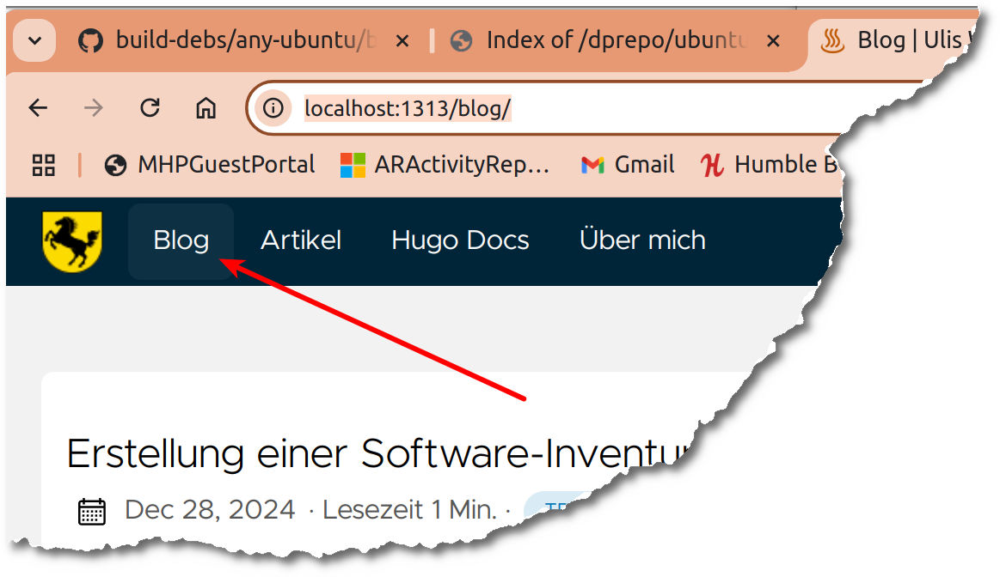
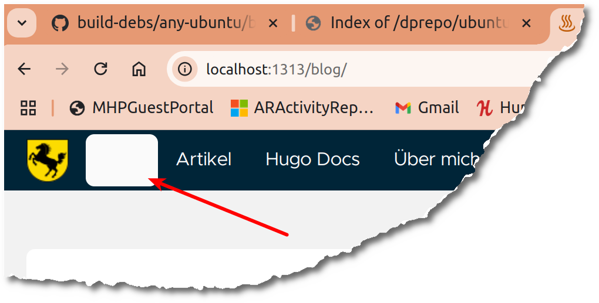

+++
date = '2025-01-05'
draft = false
title = 'Hugo-Clarity: Diverse Kleinprobleme'
categories = [ 'Hugo' ]
tags = [ 'hugo', 'clarity' ]
+++

<!--
Hugo-Clarity: Diverse Kleinprobleme
===================================
-->

Hier beschreibe ich die Korrektur von
diversen Kleinproblemen, die mir bei
dem Theme "Clarity" aufgefallen sind.
Diese (und auch andere)
habe ich aufgelistet in [Störende Details bei Hugo]()

<!--more-->

Clarity: Aktiven Eintrag im Menü markieren
------------------------------------------

"Eigentlich" ist das gar kein Problem. Der aktive Eintrag
ist markiert. Ich konnte ihn zumindest auf meinem Laptop
einfach nicht richtig erkennen:



Sichtung: Welche ColorCodes werden verwendet?

- Markierter Eintrag: #0d3042
- Menü: #002538

Tauchen diese ColorCodes im Thema Clarity auf?

- `find themes/hugo-clarity -type f|xargs grep -l '#0d3042'` -> nicht gefunden
- `find themes/hugo-clarity -type f|xargs grep -l '#002538'` -> themes/hugo-clarity/assets/sass/_variables.sass

Detailsichtung: Landet in Variable "bg". Führt leider nicht wirklich weiter!

Wo wird "menu" verwendet?

- `find themes/hugo-clarity -type f|xargs grep -l menu` -> u.a. "_components.sass"

Sichtung/Anpassung "_components.sass"

```diff
diff --git a/themes/hugo-clarity/assets/sass/_components.sass b/themes/hugo-clarity/assets/sass/_components.sass
index 59e784b..b688061 100644
--- a/themes/hugo-clarity/assets/sass/_components.sass
+++ b/themes/hugo-clarity/assets/sass/_components.sass
@@ -11,7 +11,7 @@
   justify-content: space-between
   @include content
   &_active
-    background-color: rgba($light, 0.05)
+    background-color: $haze //rgba($light, 0.05)
     border-radius: 0.25rem
   &, &_body
   &_icon
```

Damit:



Klar, so kann es nicht bleiben! Man kann die Beschriftung nicht erkennen.
Außerdem stört der "Abstand". Und bei Umstellung auf "Dark" sieht es ganz
finster aus!

Links
-----

- [Github - Hugo-Clarity](https://github.com/chipzoller/hugo-clarity)
- [Störende Details bei Hugo]()
- [Hugo: Nochmal umstellen auf das Theme Clarity]()
- [Hugo: Kurztest vom Theme Clarity]()
- [Hugo: Neustart mit dem Theme Clarity]()

Historie
--------

- 2025-01-05: Erste Version
