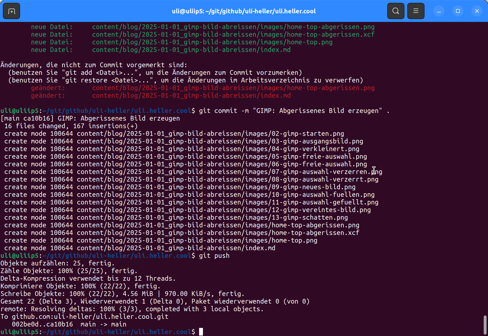

+++
date = '2025-01-09'
draft = false
title = 'GIMP: Bild abreissen'
categories = [ 'Bildchen' ]
tags = [ 'gimp' ]
+++

<!--GIMP: Bild abreissen-->
<!--====================-->

Hier zeige ich, wie man mit GIMP ein abgerissenes
Bild erzeugt, also sowas:

<!--more-->

Ausgangsbild
------------

GIMP starten
------------

Ausgangsbild laden
------------------

- Datei (File)
- Öffnen... (Open...) "images/home-top.png" wählen

Ansicht verkleinern
-------------------

- Ansicht (View)
- Vergrößerung (Zoom)
- 25%

Freie Auswahl - Bereich wählen
------------------------------

- Werkzeuge (Tools)
- Auswahlwerkzeuge (Selection Tools)
- Freie Auswahl (Free Select)
- "Kreisförmig"

Auswahl verzerren
-----------------

- Auswahl (Select)
- Verzerren... (Distort...)
  - Schwellwert (Threshold): 0,500
  - Verteilen (Spread): 8
  - Körnigkeit (Granularity): 4
  - Glätten (Smooth): 2->3
  - Horizontal glätten (Smooth horizontally): Ja
  - Vertikal glätten (Smooth vertically): Ja
  - OK

Kopieren und neues Bild erstellen
---------------------------------

- Bearbeiten (Edit)
  - Kopieren (Copy)
- Datei (File)
  - Erstellen (Create)
    - Aus Zwischenablage (From clipboard)

Erstes Bild einweißen
--------------------

- Zurück zum ersten Bild (oben, linkes Bild)
- Auswahl (Select)
  - Verzerren (Distort)
  - OK
- Farben 
  - Vordergrund: Schwarz, Hintergrund: Weiß
  - Wechseln
  - Vordergrund: Weiß, Hintergrund: Schwarz
- Werkzeuge (Tools)
  - Malwerkzeuge (Paint Tools)
  - Füllen (Bucket Fill)
  - Betroffener Bereich (Affected Area)
    - Ganze Auswahl füllen (Fill whole selection)
- In den Auswahlbereich klicken -> wird mit weiß gefüllt

Weißen Teil als Ebene einfügen
------------------------------

- Erstes Bild
- Werkzeuge (Tools)
  - Auswahlwerkzeuge (Selection Tools)
  - Freie Auswahl (Free Select)
- Bearbeiten (Edit)
  - Kopieren (Copy)
- Zweites Bild
- Bearbeiten (Edit)
  - Einfügen als... (Paste as...)
  - Als einzelne Ebene einfügen (Paste as Single Layer)
- Unten rechts: Ebenen vertauschen

Vereinen und Schatten
---------------------

- Unten rechts: Rechte Maustaste
  - Sichtbare Ebenen vereinen... (Merge Visible Layers...)
  - OK (Merge)
- Filter (Filters)
  - Licht und Schatten (Light and Shadow)
  - Schlagschatten (veraltet)... (Drop Shadow (lagacy)...)
    - VersatzX (OffsetX): 4 (oder auch 8)
    - VersatzY (OffsetY): 4 (oder auch 8)
    - Weichzeichnenradius (Blur radius): 15
    - Farbe (Color): Schwarz
    - Deckkraft (Opacity): 60
    - OK

Speichern
---------

- Datei
  - Speichern unter...
  - images/home-top-abgerissen.xcf
  - OK
  - Exportieren unter...
  - images/home-top-abgerissen.png
  - OK
  
Finales Ergebnis
----------------

Dunkles Bild
------------

Links
-----

- [GIMP](https://www.gimp.org)
- [daemons-point.com: GIMP: Bildchen abreissen](https://daemons-point.com/blog/2020/05/30/gimp-abreissen/)

Versionen
---------

Getestet mit Ubutu-22.04 und GIMP-3.0.0-RC2.

Historie
--------

- 2025-01-09: Erste Version
