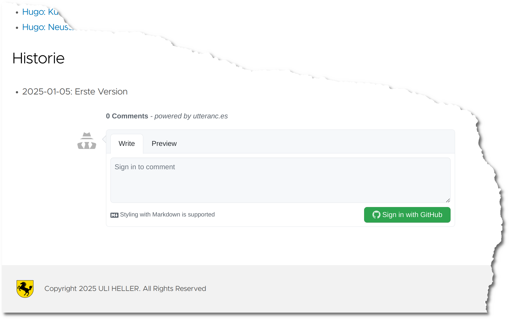

+++
date = '2025-01-13'
draft = false
title = 'Hugo-Clarity: Kommentare aktivieren'
categories = [ 'Hugo' ]
tags = [ 'hugo', 'clarity' ]
toc = true
+++

<!--
Hugo-Clarity: Kommentare aktivieren
===================================
-->

Das Hugo-Theme Clarity unterstützt die
Verwendung von Kommentaren via GithubIssues.
Hier beschreibe ich meine Erfahrungen damit!

<!--more-->

Aktivierung
-----------

```diff
diff --git a/config/_default/params.toml b/config/_default/params.toml
index b4c77f1..0868baf 100644
--- a/config/_default/params.toml
+++ b/config/_default/params.toml
@@ -106,11 +106,11 @@ disclaimerText = "Diese Webseite wird bereitgestellt auf und durch Github"
 blogDir = "blog"
 
 # Enable or disable Utterances (https://github.com/utterance/utterances) Github Issue-Based Commenting
-# utterances = true  # Run the utterances script in the single.html layout to load https://utteranc.es comments
-# utterancesRepo = "GHUsername/Repository.Name" # Utterances is enabled when this param is set
-# utterancesLabel = "blog comments ✨💬✨" # The label needs to be manually added to your Github repository issues before configuring here
-# utterancesTheme = "github-light" # Default: github-dark
-# utterancesIssueTerm = "pathname" # Default: pathname
+utterances = true  # Run the utterances script in the single.html layout to load https://utteranc.es comments
+utterancesRepo = "uli-heller/uli.heller.cool" # Utterances is enabled when this param is set
+utterancesLabel = "blog comments ✨💬✨" # The label needs to be manually added to your Github repository issues before configuring here
+utterancesTheme = "github-light" # Default: github-dark
+utterancesIssueTerm = "pathname" # Default: pathname
 
 # Enable or disable Giscus comments globally. Default to false.
 # giscus = true
```

Einrichten der App
------------------

- Link aufrufen: [UtterancesApp](https://github.com/apps/utterances)
- Nutzer auswählen: uli-heller
- Repo auswählen: uli.heller.cool
- Zugriff erlauben:
  - Metadaten lesen
  - Issues lesen und schreiben

Hinweis: Wenn man das einmalige Einrichten der "App" vergisst, dann
erscheint beim Nutzen der Kommentarfunktion diese Fehlermeldung:

Error: utterances is not installed on uli-heller/uli.heller.cool. 
If you own this repo, [install the app](https://github.com/apps/utterances).
Read more about this change in
[the PR](https://github.com/utterance/utterances/pull/25).

Kommentarfunktion aus Anwendersicht
-----------------------------------



Nach der Aktivierung erscheint am unteren Bildschirmrand ein
Kommentarfeld. Um einen Kommentar hinzuzufügen, muß man sich
bei Github anmelden und irgendwelche Privilegien an "utterances.es"
erteilen.

Oder auch hier:


Kommentarfunktion aus "meiner" Sicht
------------------------------------

Hier erste Eindrücke:

1. Ich bekomme eine Email mit dem Hinweis auf den neuen Kommentar/das neue Ticket

   

2. Leider sehe ich in der Email nicht den Inhalt der Kommentars - dazu muß
   ich auf Github nachschauen

3. Für Folgekommentare scheint es keine Emails zu geben!

4. In meinem Github-Projekt [uli.heller.cool](https://github.com/uli-heller/uli.heller.cool) erscheinen die Kommentare
   als GithubIssues. Sie können von jedem eingesehen werden!

Wertung
-------

Das Einrichten/Aktivieren hat schonmal sehr einfach funktioniert.
Dafür braucht's einmalig 5 Minuten.

Auf der [Webseite von utteranc.es](https://utteranc.es)
sieht man "unten" viele Kommentare. Die wirken sehr unübersichtlich.
Also: Wenn es zu einem Artikel viele Kommentare gibt, dann hat die
Kommentarfunktion gewisse Probleme in der Darstellung!

Die Kommentare erscheinen als GithubIssues
im Github-Projekt. Sie sind genauso wie alle meine
Texte für jeden einsehbar. Vertrauliche Informationen
sollten also NICHT in Kommentaren eingefügt werden!

Links
-----

- [Github - Hugo-Clarity](https://github.com/chipzoller/hugo-clarity)
- [Utteranc.es](https://utteranc.es/)
- [Github - uli.heller.cool](https://github.com/uli-heller/uli.heller.cool)

Historie
--------

- 2025-01-13: Erste Version
