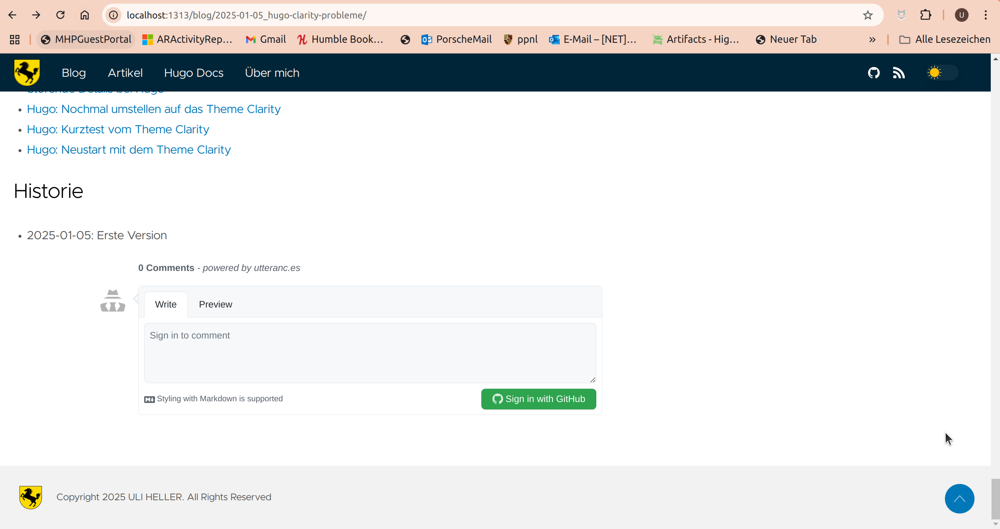

+++
date = '2025-01-13'
draft = false
title = 'Hugo-Clarity: Kommentare aktivieren'
categories = [ 'Hugo' ]
tags = [ 'hugo', 'clarity' ]
toc = true
+++

<!--
Hugo-Clarity: Kommentare aktivieren
===================================
-->

Das Hugo-Theme Clarity unterstützt die
Verwendung von Kommentaren via GithubIssues.
Hier beschreibe ich meine Erfahrungen damit!

<!--more-->

Aktivierung
-----------

```diff
diff --git a/config/_default/params.toml b/config/_default/params.toml
index b4c77f1..0868baf 100644
--- a/config/_default/params.toml
+++ b/config/_default/params.toml
@@ -106,11 +106,11 @@ disclaimerText = "Diese Webseite wird bereitgestellt auf und durch Github"
 blogDir = "blog"
 
 # Enable or disable Utterances (https://github.com/utterance/utterances) Github Issue-Based Commenting
-# utterances = true  # Run the utterances script in the single.html layout to load https://utteranc.es comments
-# utterancesRepo = "GHUsername/Repository.Name" # Utterances is enabled when this param is set
-# utterancesLabel = "blog comments ✨💬✨" # The label needs to be manually added to your Github repository issues before configuring here
-# utterancesTheme = "github-light" # Default: github-dark
-# utterancesIssueTerm = "pathname" # Default: pathname
+utterances = true  # Run the utterances script in the single.html layout to load https://utteranc.es comments
+utterancesRepo = "uli-heller/uli.heller.cool" # Utterances is enabled when this param is set
+utterancesLabel = "blog comments ✨💬✨" # The label needs to be manually added to your Github repository issues before configuring here
+utterancesTheme = "github-light" # Default: github-dark
+utterancesIssueTerm = "pathname" # Default: pathname
 
 # Enable or disable Giscus comments globally. Default to false.
 # giscus = true
```

Kommentarfunktion aus Anwendersicht
-----------------------------------



Nach der Aktivierung erscheint am unteren Bildschirmrand ein
Kommentarfeld. Um einen Kommentar hinzuzufügen, muß man sich
bei Github anmelden und irgendwelche Privilegien an "utterances.es"
erteilen.

Danach erscheint aktuell eine Fehlermeldung wie diese:

Error: utterances is not installed on uli-heller/uli.heller.cool. 
If you own this repo, [install the app](https://github.com/apps/utterances).
Read more about this change in
[the PR](https://github.com/utterance/utterances/pull/25).

Kommentarfunktion aus "meiner" Sicht
------------------------------------

TBD

Wertung
-------

Das Einrichten/Aktivieren hat schonmal sehr einfach funktioniert.
Dafür braucht's einmalig 5 Minuten.

Auf der [Webseite von utteranc.es](https://utteranc.es)
sieht man "unten" viele Kommentare. Die wirken sehr unübersichtlich.
Also: Wenn es zu einem Artikel viele Kommentare gibt, dann hat die
Kommentarfunktion gewisse Probleme in der Darstellung!

Links
-----

- [Github - Hugo-Cla)rity](https://github.com/chipzoller/hugo-clarity)
- [Utteranc.es](https://utteranc.es/)

Historie
--------

- 2025-01-13: Erste Version
