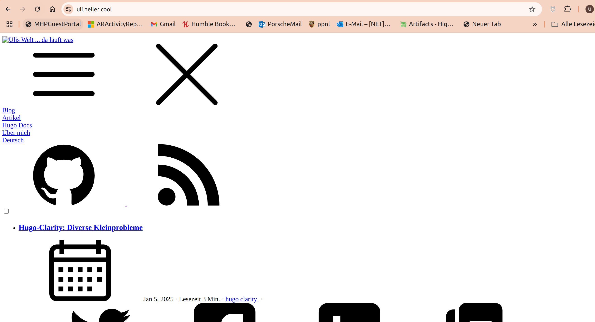

+++
date = '2025-01-14'
draft = false
title = 'Hugo-Clarity: Darstellungsprobleme'
categories = [ 'Hugo' ]
tags = [ 'hugo', 'clarity' ]
toc = true
+++

<!--
Hugo-Clarity: Darstellungsprobleme
==================================
-->

Nach der Umstellung auf Hugo-Theme Clarity
sieht meine Webseite unter [https://uli.heller.cool](https://uli.heller.cool)
total zerstört aus. Mit `hugo server`
ist alles OK...

<!--more-->

Zerstörte Anzeige
-----------------

Meine Webseite unter [https://uli.heller.cool](https://uli.heller.cool)
nach Umstellung auf das Hugo-Theme Clarity:



Korrektur
---------

```diff
diff --git a/.github/workflows/hugo.yaml b/.github/workflows/hugo.yaml
index d0d67c2..399c5d6 100644
--- a/.github/workflows/hugo.yaml
+++ b/.github/workflows/hugo.yaml
@@ -59,8 +59,7 @@ jobs:
           hugo \
             --gc \
             --minify \
-            --source .\
-            --baseURL "${{ steps.pages.outputs.base_url }}/"          
+            --source .
       - name: Upload artifact
         uses: actions/upload-pages-artifact@v3
         with:
```

Also: Man muß `--baseURL ...` aus der Github-Action entfernen!

Links
-----

- [Github - Hugo-Clarity](https://github.com/chipzoller/hugo-clarity)

Historie
--------

- 2025-01-14: Erste Version
