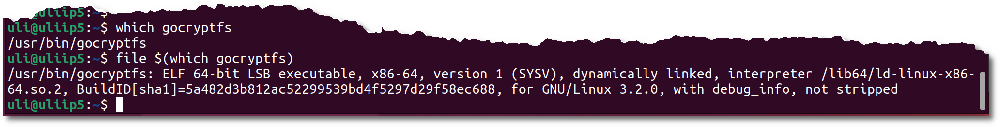

+++
date = '2025-01-18'
draft = false
title = 'Terminal-Ausgaben in Emails'
categories = [ 'Email' ]
tags = [ 'email', 'roundcube' ]
toc = true
+++

<!--
Terminal-Ausgaben in Emails
===========================
-->

Relativ häufig verschicke ich Emails mit
Anleitungen zu Terminalein- und -ausgaben.
Schön ist's, wenn die dann ansprechend aussehen.
Und als Text kopierbar sind. Nachfolgend ein
paar Rezepte mit Roundcube.

<!--more-->

Aufgabestellung
---------------

Ich hätte gerne den nachfolgenden Terminal-Ausschnitt in einer
Email. Er soll möglichst ähnlich zum Bild aussehen und kopierbaren
Text enthalten. Hier das Bild:



Text
----

Man kann die Email einfach als Textmail verfassen. Das sieht
dann grob so aus:

```
Hier meine Terminalein- und Ausgaben:

  uli@uliip5:~$ which gocryptfs
  /usr/bin/gocryptfs
  uli@uliip5:~$ file $(which gocryptfs)
  /usr/bin/gocryptfs: ELF 64-bit LSB executable, x86-64, version 1 (SYSV), dynamically linked, interpreter /lib64/ld-linux-x86-64.so.2, BuildID[sha1]=5a482d3b812ac52299539bd4f5297d29f58ec688, for GNU/Linux 3.2.0, with debug_info, not stripped
  uli@uliip5:~$ 
```

Vorteil: SEHR einfach zu erstellen, Terminalinhalt mittels kopieren+einfügen
übertragen

Nachteil: Optisch nicht sonderlich ansprechend!

Markdown
--------

- EMail erstellen
- Wechseln in die HTML-Erstellung
- Nachfolgende Markdown-Codierung eingeben:

  ```
    Hier meine Terminalein- und Ausgaben:

    \```
    uli@uliip5:~$ which gocryptfs
    /usr/bin/gocryptfs
    uli@uliip5:~$ file $(which gocryptfs)
    /usr/bin/gocryptfs: ELF 64-bit LSB executable, x86-64, version 1 (SYSV), dynamically linked, interpreter /lib64/ld-linux-x86-64.so.2, BuildID[sha1]=5a482d3b812ac52299539bd4f5297d29f58ec688, for GNU/Linux 3.2.0, with debug_info, not stripped
    uli@uliip5:~$
    \```
  ```

- Text markieren
- Rechte Maustaste - Markdown an/aus

Das Ergebnis sieht grob so aus wie nachfolgend!
Die schwarzen Balken links und rechts kommen von meiner Hugo-Formatierung,
in Mails sind die weg! Der Text ist kopierbar!

Hier meine Terminalein- und Ausgaben:

```
uli@uliip5:~$ which gocryptfs
/usr/bin/gocryptfs
uli@uliip5:~$ file $(which gocryptfs)
/usr/bin/gocryptfs: ELF 64-bit LSB executable, x86-64, version 1 (SYSV), dynamically linked, interpreter /lib64/ld-linux-x86-64.so.2, BuildID[sha1]=5a482d3b812ac52299539bd4f5297d29f58ec688, for GNU/Linux 3.2.0, with debug_info, not stripped
uli@uliip5:~$
```

Vorteil: Einfach zu erstellen, Terminalinhalt mittels kopieren+einfügen
übertragen

Nachteil: Optisch nicht sonderlich ansprechend!

HTML
----

- Terminal: Markieren + "Als HTML kopieren"
- EMail erstellen
- Wechseln in die HTML-Erstellung
- Mail-Beginn eintippen: "Hier meine Terminalein- und -ausgaben:"
- Mail-Formatierung: Quelltext
- Unterhalb der Zeile mit "Terminalein- und -ausgaben": Leerzeile einfügen
- In Leerzeile: Einfügen (Strg-V)
- Beim "führenden" `<pre>`:
  - Von: `<pre>`
  - Nach: `<pre style="background-color: gray; color: white">`
- Speichern

Das Ergebnis sieht dann grob so aus:

<div class="pre">
<div>&nbsp;</div>
<div><span>Hier meine Terminalein- und Ausgaben:</span></div>
<pre style="background-color: gray; color: white;"><span style="color: #26a269;"><strong>uli@uliip5</strong></span>:<span style="color: #12488b;"><strong>~</strong></span>$ which gocryptfs
/usr/bin/gocryptfs
<span style="color: #26a269;"><strong>uli@uliip5</strong></span>:<span style="color: #12488b;"><strong>~</strong></span>$ file $(which gocryptfs)
/usr/bin/gocryptfs: ELF 64-bit LSB executable, x86-64, version 1 (SYSV), dynamically linked, interpreter /lib64/ld-linux-x86-64.so.2, BuildID[sha1]=5a482d3b812ac52299539bd4f5297d29f58ec688, for GNU/Linux 3.2.0, with debug_info, not stripped
<span style="color: #26a269;"><strong>uli@uliip5</strong></span>:<span style="color: #12488b;"><strong>~</strong></span>$ 
</pre>

<!--
Links
-----

- [archive.org - Wayback-Machine](https://archive.org)
- [https://www.idontplaydarts.com](https://www.idontplaydarts.com/2016/04/detecting-curl-pipe-bash-server-side/) - Zertifikat abgelaufen
-->

Versionen
---------

Getestet mit Roundcube-1.6.9 und Chrome-131.0.6778.204.

Historie
--------

- 2025-01-18: Erste Version
