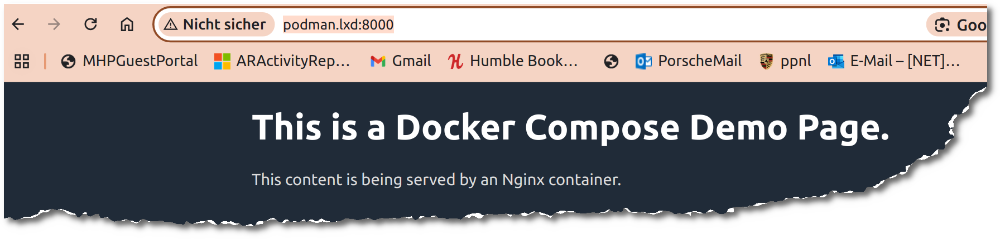

+++
date = '2025-02-06'
draft = false
title = 'LXC/LXD: Podman Compose'
categories = [ 'LXC/LXD' ]
tags = [ 'lxc', 'lxd', 'docker', 'podman', 'linux', 'ubuntu' ]
+++

<!--
LXC/LXD: Podman Compose
=======================
-->

Ich möchte ausprobieren, ob "podman compose"
grundsätzlich funktioniert und ob man dabei
ohne "root" klarkommt.

<!--more-->

Ausgangspunkt
-------------

Container mit Podman, bspw.

- [LXC/LXD: Podman im Container mit Ubuntu-24.04]()

Sichten von [Github: podman-compose](https://github.com/containers/podman-compose).

"podman-compose" einspielen
---------------------------

### Vorgefertigtes Paket

```
lxc exec podman apt install podman-compose
```

Damit wird Version 1.0.6-1 eingespielt.

### Manuell

Die manuelle Installation verwende ich vorerst nicht!

- Herunterladen: [podman-compose-1.3.0.tar.gz](https://github.com/containers/podman-compose/archive/refs/tags/v1.3.0.tar.gz)
- Virencheck via Virustotal: OK
- LXC-Container starten: `lxc start podman`
- "podman-compose" in LXC-Container kopieren:
  - Entweder: `scp podman-compose-1.3.0.tar.gz ubuntu@podman.lxd:`
  - Oder: `lxc exec podman --user 1000 --group 1000 --cwd /home/ubuntu tee podman-compose-1.3.0.tar.gz >/dev/null <podman-compose-1.3.0.tar.gz`
- Auspacken:
  ```
  uheller:~$ lxc exec podman -- sudo -u ubuntu -i

  ubuntu@podman:~$ gzip -cd podman-compose-1.3.0.tar.gz|tar xf - podman-compose-1.3.0/podman_compose.py
  ubuntu@podman:~$ mkdir -p ~/.local/bin
  ubuntu@podman:~$ mv podman-compose-1.3.0/podman_compose.py ~/.local/bin
  ubuntu@podman:~$ ln -s podman_compose.py ~/.local/bin/podman-compose
  ubuntu@podman:~$ rm -rf podman-compose-1.3.0
  ubuntu@podman:~$ .local/bin/podman-compose --version
  podman-compose version 1.3.0
  podman version 4.9.3
  ```

### Versionstest

```
ubuntu@podman:~/compose-demo$ podman-compose --version
podman-compose version: 1.0.6
['podman', '--version', '']
using podman version: 4.9.3
podman-compose version 1.0.6
podman --version 
podman version 4.9.3
exit code: 0
```

Kurztest
--------

Übernommen aus [daemons-point.com: Docker mit docker-compose in LXD/LXC-Container](https://daemons-point.com/blog/2022/12/26/docker-compose-in-lxc-container/) und  [DigitalOcean: How To Install and Use Docker Compose on Ubuntu 20.04](https://www.digitalocean.com/community/tutorials/how-to-install-and-use-docker-compose-on-ubuntu-20-04).

### Projektverzeichnis anlegen

```
ubuntu@podman:~$ mkdir -p compose-demo/app
```

### compose-demo/app/index.html

```html
<!doctype html>
<html lang="en">
<head>
    <meta charset="utf-8">
    <title>Docker Compose Demo</title>
    <link rel="stylesheet" href="https://cdn.jsdelivr.net/gh/kognise/water.css@latest/dist/dark.min.css">
</head>
<body>

    <h1>This is a Docker Compose Demo Page.</h1>
    <p>This content is being served by an Nginx container.</p>

</body>
</html>
```

### compose-demo/docker-compose.yml

```yml
version: '3.7'
services:
  web:
    image: docker.io/library/nginx:alpine
    ports:
      - "8000:80"
    volumes:
      - ./app:/usr/share/nginx/html
```

### Ausführen

```
ubuntu@podman:~$ cd compose-demo/
ubuntu@podman:~/compose-demo $ podman-compose up -d
podman-compose version: 1.0.6
['podman', '--version', '']
using podman version: 4.9.3
** excluding:  set()
['podman', 'ps', '--filter', 'label=io.podman.compose.project=compose-demo', '-a', '--format', '{{ index .Labels "io.podman.compose.config-hash"}}']
['podman', 'network', 'exists', 'compose-demo_default']
podman run --name=compose-demo_web_1 -d --label io.podman.compose.config-hash=be7ff51131af7f196fd632cfa16569e788b3c2d559bfd96addb9f1eb5ef8eb69 --label io.podman.compose.project=compose-demo --label io.podman.compose.version=1.0.6 --label PODMAN_SYSTEMD_UNIT=podman-compose@compose-demo.service --label com.docker.compose.project=compose-demo --label com.docker.compose.project.working_dir=/home/ubuntu/compose-demo --label com.docker.compose.project.config_files=docker-compose.yml --label com.docker.compose.container-number=1 --label com.docker.compose.service=web -v /home/ubuntu/compose-demo/app:/usr/share/nginx/html --net compose-demo_default --network-alias web -p 8000:80 docker.io/library/nginx:alpine
Trying to pull docker.io/library/nginx:alpine...
Getting image source signatures
Copying blob 5d777e0071f6 done   | 
Copying blob e0350d1fd4dd done   | 
Copying blob dbcfe8732ee6 done   | 
Copying blob 37d775ecfbb9 done   | 
Copying blob 66a3d608f3fa done   | 
Copying blob 58290db888fa done   | 
Copying blob 1f4aa363b71a done   | 
Copying blob e74fff0a393a done   | 
Copying config 93f9c72967 done   | 
Writing manifest to image destination
878f64eb0be7bdc1c9aaa8f45d199faecb4a2684fbad67c09e89c9f41e694c30
exit code: 0

ubuntu@podman:~/compose-demo$ podman compose ps
['podman', '--version', '']
using podman version: 4.9.3
podman ps -a --filter label=io.podman.compose.project=compose-demo
CONTAINER ID  IMAGE                           COMMAND               CREATED        STATUS        PORTS                 NAMES
878f64eb0be7  docker.io/library/nginx:alpine  nginx -g daemon o...  3 minutes ago  Up 3 minutes  0.0.0.0:8000->80/tcp  compose-demo_web_1
exit code: 0
```

### Test mit Browser

[Testseite - http://podman.lxd:8000](http://podman.lxd:8000/)



Probleme
--------

### Error: short-name "nginx:alpine" did not resolve

Fehlermeldung:

```
ubuntu@podman:~/compose-demo$ podman-compose up -d
podman-compose version: 1.0.6
['podman', '--version', '']
using podman version: 4.9.3
** excluding:  set()
['podman', 'ps', '--filter', 'label=io.podman.compose.project=compose-demo', '-a', '--format', '{{ index .Labels "io.podman.compose.config-hash"}}']
['podman', 'network', 'exists', 'compose-demo_default']
['podman', 'network', 'create', '--label', 'io.podman.compose.project=compose-demo', '--label', 'com.docker.compose.project=compose-demo', 'compose-demo_default']
['podman', 'network', 'exists', 'compose-demo_default']
podman run --name=compose-demo_web_1 -d --label io.podman.compose.config-hash=1267f1fcc2605edffffac19ad9686d7cb3f189e3f1fa80ccc2e27e3d4d8b2e66 --label io.podman.compose.project=compose-demo --label io.podman.compose.version=1.0.6 --label PODMAN_SYSTEMD_UNIT=podman-compose@compose-demo.service --label com.docker.compose.project=compose-demo --label com.docker.compose.project.working_dir=/home/ubuntu/compose-demo --label com.docker.compose.project.config_files=docker-compose.yml --label com.docker.compose.container-number=1 --label com.docker.compose.service=web -v /home/ubuntu/compose-demo/app:/usr/share/nginx/html --net compose-demo_default --network-alias web -p 8000:80 nginx:alpine
Error: short-name "nginx:alpine" did not resolve to an alias and no unqualified-search registries are defined in "/etc/containers/registries.conf"
exit code: 125
podman start compose-demo_web_1
Error: no container with name or ID "compose-demo_web_1" found: no such container
exit code: 125
```

Korrektur:

```diff
--- docker-compose.yml.orig	2025-02-02 11:20:35.377085085 +0100
+++ docker-compose.yml	2025-02-02 11:18:51.776290702 +0100
@@ -1,7 +1,7 @@
 version: '3.7'
 services:
   web:
-    image: nginx:alpine
+    image: docker.io/library/nginx:alpine
     ports:
       - "8000:80"
     volumes:
```

Versionen
---------

- Getestet unter Ubuntu 22.04 mit LXD-6.2-bde4d03
  (Snap-Version)
- Getestet mit einem Ubuntu-24.04-Container
  und podman-4.9.3+ds1-1ubuntu0.2
  und podman-compose-1.0.6-1

Links
-----

- [LXC/LXD: Podman im Container mit Ubuntu-24.04]()
- [daemons-point.com - Docker in LXD/LXC-Container](https://daemons-point.com/blog/2022/12/25/docker-in-lxc-container/)
- [daemons-point.com: Docker mit docker-compose in LXD/LXC-Container](https://daemons-point.com/blog/2022/12/26/docker-compose-in-lxc-container/)
- [DigitalOcean: How To Install and Use Docker Compose on Ubuntu 20.04](https://www.digitalocean.com/community/tutorials/how-to-install-and-use-docker-compose-on-ubuntu-20-04)

Historie
--------

- 2025-02-06: Erste Version
