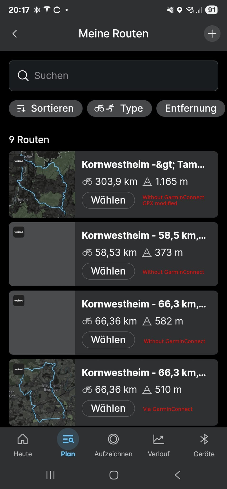

+++
date = '2025-06-27'
draft = true
title = 'ANSIBLE: Alte Version in einem Container verwenden'
categories = [ 'devops' ]
tags = [ 'ansible', 'linux', 'ubuntu' ]
+++

<!--ANSIBLE: Alte Version in einem Container verwenden-->
<!--======================================-->

Meine geplanten Touren kann ich zwar problemlos in die
Wahoo-App importieren, das Übertragen an meinen Wahoo-ACE
klappt aber nicht.

<!-- more -->

Mai 2025
--------

Juni 2025
---------

Im Juni 2025 hat sich die Situation verbessert.
Die Übertragung klappt nun. Einzig die Routen-Vorschau
fehlt:



Vergleich Kopfzeilen
--------------------

### Rohdateien

bikerouter.de:

```xml
<?xml version="1.0" encoding="UTF-8"?>
<!-- track-length = 66312 filtered ascend = 495 plain-ascend = 15 cost=75512 energy=0.4kwh time=3h 37m 37s -->
<gpx 
 xmlns="http://www.topografix.com/GPX/1/1" 
 xmlns:xsi="http://www.w3.org/2001/XMLSchema-instance" 
 xsi:schemaLocation="http://www.topografix.com/GPX/1/1 http://www.topografix.com/GPX/1/1/gpx.xsd" 
 version="1.1" 
 creator="bikerouter.de 2025.45">
 <trk>
  <name>Kornwestheim - 66,3 km, 495 hm</name>
  <link href="https://bikerouter.de/#map=14/48.8617/9.1327/osm-mapnik-german_style,Waymarked_Trails-Cycling&amp;lonlats=9.182458,48.870317;9.131003,48.95027;9.140616,48.998154;9.150827,49.0088;9.11247,49.014376;9.021516,48.998516;9.006242,48.957488;9.055223,48.940076;9.053231,48.915696;9.072796,48.902039;9.070309,48.879643;9.087213,48.858915;9.097425,48.865072;9.167445,48.868179&amp;profile=trekking">
   <text>bikerouter.de</text>
  </link>
  <trkseg>
   <trkpt lat="48.870304" lon="9.182487"><ele>308.5</ele></trkpt>
```

garminconnect:

```xml
<?xml version="1.0" encoding="UTF-8"?>
<gpx creator="Garmin Connect" version="1.1"
  xsi:schemaLocation="http://www.topografix.com/GPX/1/1 http://www.topografix.com/GPX/11.xsd"
  xmlns:ns3="http://www.garmin.com/xmlschemas/TrackPointExtension/v1"
  xmlns="http://www.topografix.com/GPX/1/1"
  xmlns:xsi="http://www.w3.org/2001/XMLSchema-instance" xmlns:ns2="http://www.garmin.com/xmlschemas/GpxExtensions/v3">
  <metadata>
    <name>Kornwestheim - 66,3 km, 495 hm</name>
    <link href="connect.garmin.com">
      <text>Garmin Connect</text>
    </link>
    <time>2025-06-25T16:51:52.000Z</time>
  </metadata>
  <trk>
    <name>Kornwestheim - 66,3 km, 495 hm</name>
    <trkseg>
      <trkpt lat="48.87030397541821" lon="9.182486990466714">
        <ele>309.52</ele>
        <time>2025-06-25T16:51:52.000Z</time>
      </trkpt>
```

### Formatiert

bikerouter.de:

```xml
<gpx xmlns="http://www.topografix.com/GPX/1/1" xmlns:xsi="http://www.w3.org/2001/XMLSchema-instance" xsi:schemaLocation="http://www.topografix.com/GPX/1/1 http://www.topografix.com/GPX/1/1/gpx.xsd" version="1.1" creator="bikerouter.de 2025.45">
  <trk>
    <name>Kornwestheim - 66,3 km, 495 hm</name>
    <link href="https://bikerouter.de/#map=14/48.8617/9.1327/osm-mapnik-german_style,Waymarked_Trails-Cycling&lonlats=9.182458,48.870317;9.131003,48.95027;9.140616,48.998154;9.150827,49.0088;9.11247,49.014376;9.021516,48.998516;9.006242,48.957488;9.055223,48.940076;9.053231,48.915696;9.072796,48.902039;9.070309,48.879643;9.087213,48.858915;9.097425,48.865072;9.167445,48.868179&profile=trekking">
      <text>bikerouter.de</text>
    </link>
    <trkseg>
      <trkpt lat="48.870304" lon="9.182487">
      <ele>308.5</ele>
    </trkpt>
```

garminconnect:

```xml
<gpx xmlns:ns3="http://www.garmin.com/xmlschemas/TrackPointExtension/v1" xmlns="http://www.topografix.com/GPX/1/1" xmlns:xsi="http://www.w3.org/2001/XMLSchema-instance" xmlns:ns2="http://www.garmin.com/xmlschemas/GpxExtensions/v3" creator="Garmin Connect" version="1.1" xsi:schemaLocation="http://www.topografix.com/GPX/1/1 http://www.topografix.com/GPX/11.xsd">
  <metadata>
    <name>Kornwestheim - 66,3 km, 495 hm</name>
    <link href="connect.garmin.com">
      <text>Garmin Connect</text>
    </link>
    <time>2025-06-25T16:51:52.000Z</time>
  </metadata>
  <trk>
    <name>Kornwestheim - 66,3 km, 495 hm</name>
    <trkseg>
      <trkpt lat="48.87030397541821" lon="9.182486990466714">
        <ele>309.52</ele>
        <time>2025-06-25T16:51:52.000Z</time>
      </trkpt>
```

Tests
-----

- Original-Track von bikerouter.de: br-300-00.gpx
- Ohne "link" bei "trk": br-300-01.gpx


Links
-----

- [Github: Ubuntu-Images für LXC](https://github.com/uli-heller/lxc-ubuntu-i386-amd64/releases/tag/v1.12.1)
- [Github: ansible-2.9.27.tar.gz](https://codeload.github.com/ansible/ansible/tar.gz/v2.9.27)

Versionen
---------

Getestet mit

- Ubuntu-22.04 und LXC-Image von Ubuntu-20.04 (focal)

Historie
--------

- 2025-06-27: Erste Version
