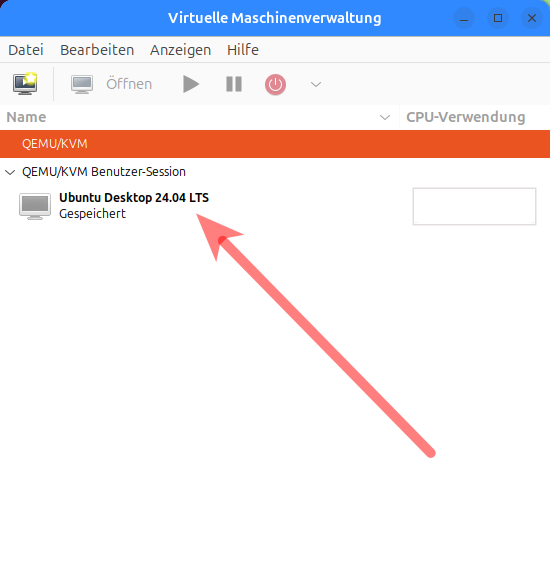
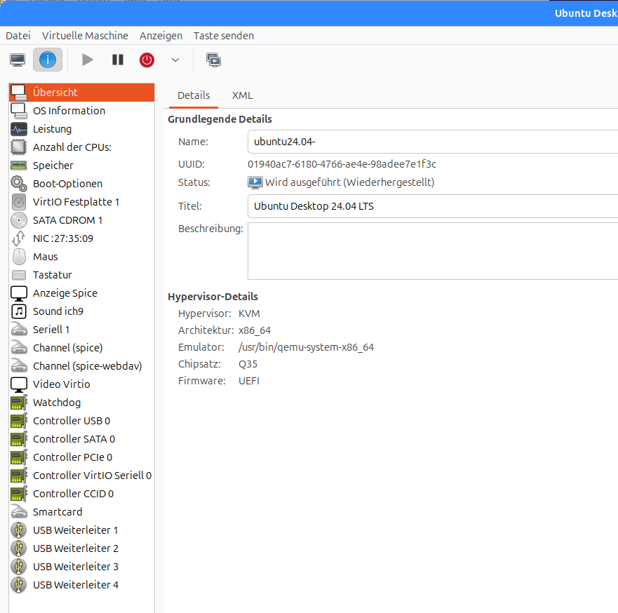

+++
date = '2025-07-16'
draft = false
title = 'VirtManager und Zugriff auf Gnome-Boxes'
categories = [ 'Virtualisierung' ]
tags = [ 'virtmanager', 'gnome boxes', 'ubuntu', 'linux' ]
+++

<!--
VirtManager und Zugriff auf Gnome-Boxes
=======================================
-->

Meine ersten Erfahrungen mit Gnome-Boxes sind
recht gut: Sehr einfach zu bedienen und es
funktioniert.

Manchmal möchte ich aber doch ein wenig mehr
Dinge einstellen können. Das sollte mit
VIRTMANAGER möglich sein. Mal sehen, wie's
klappt!

<!--more-->

Installation
------------

```
sudo apt update
sudo apt upgrade
sudo apt install -y virt-manager
```

Verbindung zwischen VIRTMANAGER und Gnome-Boxes herstellen
----------------------------------------------------------

- VIRTMANAGER starten: `virt-manager`
- Datei - Verbindung hinzufügen...
  - Hypervisor: QEMU/KVM Benutzer-Session
  - Automatische Verbindung: Ja
  - Verbinden

Danach erscheint die unter Gnome-Boxes angelegte VM in der
Oberfläche von VIRTMANAGER:



VM starten
----------

Die VM kann einfach über die Oberfläche von
VIRTMANAGER gestartet werden. "Sehen" kann man
die VM erstmal nicht, dazu muß man noch "Öffnen"
anwählen.

Auffällig: Die Fenstergröße wird nicht automatisch
angepasst. Dies läßt sich einfach korrigieren
mit

- Anzeigen
- Anzeige skalieren
- Größe automatisch mit Fenster anpassen: Ja

Konfigurationsdetails
---------------------

Die Konfigurationsdetails können gesichtet und geändert
werden mit

- Anzeigen
- Details

Das sieht dann so aus:



Versionen
---------

- Ubuntu-24.04
- Kernel 6.11.0-29-generic
- Gnome-Boxes 46.0-1build1
- VirtManager 1:4.1.0-3ubuntu0.1

Links
-----

- [Getting Started with Gnome Boxes](https://www.lorenzobettini.it/2024/04/getting-started-with-gnome-boxes/)

Historie
--------

- 2025-07-16: Erste Version
