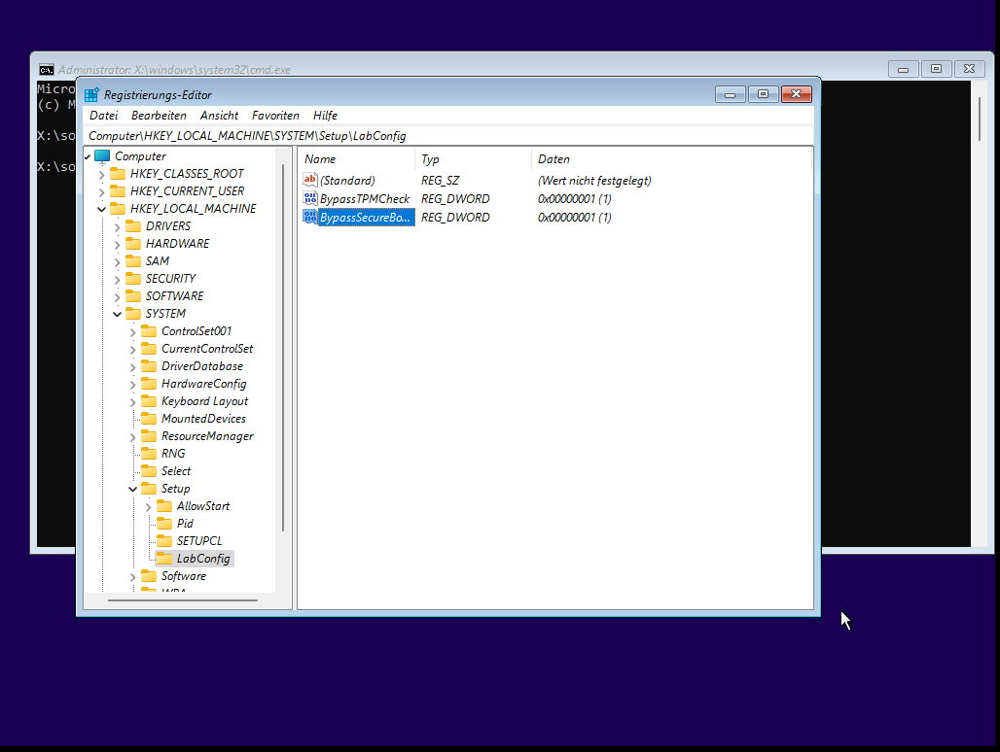

+++
date = '2026-02-08'
draft = false
title = 'Windows 11 in Gnome-Boxes'
categories = [ 'Virtualisierung' ]
tags = [ 'gnome boxes', 'ubuntu', 'linux' ]
+++

<!--
Windows 11 in Gnome-Boxes
=========================
-->

Gestern habe ich Windows 10 in Gnome-Boxes installiert.
Eine Anleitung findet sich [hier (Windows 10 in Gnome-Boxes)]().

Windows 11 klappt nicht ganz so einfach wegen der Mindestvoraussetzungen
TPM und SecureBoot. Mit etwas Spielerei klappt es aber.
Hier die Details!

<!--more-->

Windows-11-ISO
--------------

Für die Installation habe ich diese
ISO-Datei verwendet: Win11_23H2_German_x64v2.iso.
Sie ist recht alt und das ist Absicht. Man konnte sie früher mal bei
Microsoft herunterladen. Keine Ahnung, ob das immer
noch klappt. Mit der alten Version kann man die Prüfung der
Mindestvoraussetzungen abschalten, bei neueren scheint es
Probleme zu geben (=habe ich nicht überprüft).

Grundinstallation
-----------------

Die Grundinstallation innerhalb von Gnome-Boxes ist mega-einfach:

- Neue Box anlegen
- Windows-11-ISO auswählen
- 16 GB Hauptspeicher
- 50 GB Plattenspeicher
- Dann die Installation starten
- Bei der Sprachauswahl "Shift-F10" drücken -> Kommandozeile erscheint
- Kommando `regedit` ausführen -> RegistryEditor wird gestartet
- Wechseln zu HKEY_LOCAL_MACHINE - SYSTEM - Setup
- Rechter Bereich: Neuen RegistryKey anlegen - LabConfig
- Wechseln zu LabConfig
- Rechter Bereich: Neuen DWORD(32-bit)-Wert anlegen
  - BypassTPMCheck
  - Doppelklick -> Wert 1
- Rechter Bereich: Neuen DWORD(32-bit)-Wert anlegen
  - BypassSecureBootCheck
  - Doppelklick -> Wert 1
- Rechter Bereich: Neuen DWORD(32-bit)-Wert anlegen
  - BypassRAMCheck
  - Doppelklick -> Wert 1
- RegistryEditor schliessen
- Installation fortsetzen

Zwischenstand vom RegistryEditor:

Die vorigen Anpassungen sind [hier bei TomsHardware](https://www.tomshardware.com/how-to/bypass-windows-11-tpm-requirement) beschrieben!

Konfiguration
-------------

Nach der Installation erscheint der Konfigurationsassistent.
Diesen auch "durchklicken". Ich denke, es sind ein paar Neustarts
erforderlich.

Aktualisierungen
----------------

Nach der Konfiguration alle Aktualisierungen einspielen!
Das erfordert viele Downloads und ein paar weitere Neustarts!

Verbesserung der Integration
----------------------------

Auffällig und störend sind:

- Schlechte Bildschirmauflösung
- Schlechte Mausintegration - wird immer "gefangen" und muß mit "links-strg-alt" wieder befreit werden
- "Kopieren und Einfügen" funktioniert nicht zwischen Windows und Linux

Zur Abhilfe können die "spice-guest-tools" von [https://www.spice-space.org](https://www.spice-space.org) eingespielt werden:

- [spice-guest-tools-0.141.exe](https://www.spice-space.org/download/windows/spice-guest-tools/spice-guest-tools-0.141/spice-guest-tools-0.141.exe) herunterladen
- Virencheck
- Ausführen -> alles "abnicken"

Danach klappt's perfekt!

Versionen
---------

- Ubuntu-24.04.3
- Kernel 6.17.0-14-generic
- Gnome-Boxes 46.0-1build1
- VirtManager 1:4.1.0-3ubuntu0.1

Links
-----

- [spice-guest-tools-0.141.exe](https://www.spice-space.org/download/windows/spice-guest-tools/spice-guest-tools-0.141/spice-guest-tools-0.141.exe)
- [Windows in VirtManager]()
- [Windows 10 in Gnome-Boxes]()
- [TomsHardware - Bypass Win11 TPM Requirement](https://www.tomshardware.com/how-to/bypass-windows-11-tpm-requirement)

Historie
--------

- 2026-02-08: Erste Version
