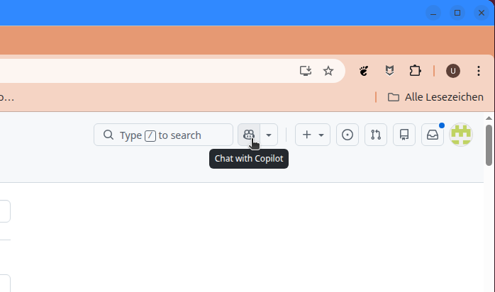

+++
date = '2026-04-05'
draft = false
title = 'Praxistests mit Copilot - ssh-pubkey-decoder'
categories = [ 'KI' ]
tags = [ 'copilot' ]
+++

<!--
Praxistests mit Copilot - ssh-pubkey-decoder
===========================================
-->

Vorweg: Von meiner Grundeinstellung her bin ich ein KI-Kritiker.
Ich sehe gewisse Vorteile in der Nutzung, ich sehe aber
auch Probleme beim Erhalt des Wissens. Grob ist es aktuell ja
so: Die KI-Modelle haben quasi das gesamte Wissen des Internets aufgesaugt
und präsentieren und ein Destillat davon. Die Quellen
des Wissens gehen dabei unter. Sie werden nirgends erwähnt.
Unabhängig davon, ob die Copyrights der Artikel anderes festschreiben.
Sieht für mich nicht nach richtiger Anwendung ("fair use") aus!

Der Anreiz, weiterhin Wissen zu veröffentlichen, wird
für den einzelnen damit immer geringer!

Dennoch möchte ich hier eine KI-Nutzung kurz vorstellen,
das Ergebnis ist garnicht so schlecht!

<!--more-->

Vorstellung des Grundproblems
-----------------------------

Schon seit ein paar Wochen beschäftigt mich ein Randaspekt von
SSH-PubKeys. Konkret: Mir ist unklar, ob ich am PubKey erkennen
kann

- ob er mit einem FIDO2-Gerät verknüpft ist (das ist einfach)
- ob er bei Verwendung einen Knopfdruck anfordert ("user presence")
- ob er bei Verwendung die PIN anfordert ("user verification")
- ob es sich um einen auf dem FIDO2-Gerät gespeicherten PubKey handelt ("resident key")

Traditionelle Lösung
--------------------

Immer mal wieder hab ich Google und andere Suchmaschinen
bemüht mit Fragen wie:

- "query fido2 options for pubkeys" -> viel Information, nicht sonderlich sinnvolles
- "ssh-keygen" -> [https://linux.die.net/man/1/ssh-keygen](https://linux.die.net/man/1/ssh-keygen)
- usw.

Letztlich erstmal kein durchschlagender Erfolg!

Dann habe ich mich an Github erinnert. Github akzeptiert
SSH-Schlüssel, die mit einem FIDO2-Gerät verknüpft sind.
Github akzeptiert aber keinen SSH-Schlüssel, bei dem man
nicht auf das FIDO2-Gerät drücken muß. Also: Irgendwie
muß das für die Server-Seite unterscheidbar sein.
Noch eine Suche:

- "sshd.config" -> [https://manpages.ubuntu.com/manpages/jammy/de/man5/sshd_config.5.html](https://manpages.ubuntu.com/manpages/jammy/de/man5/sshd_config.5.html) -> PubkeyAuthOptions - "touch-required", "verify-required"

Also: Der OpenSSH-Server hat Optionen, mit denen man festlegen
kann welche Optionen beim PubKey gesetzt sein müssen.
Im OpenSSH-Server muß das irgendwie implementiert sein.
Sichtung des Quelltextes sollte die Lösung bringen!

Mangels Zeit habe ich dies hier erstmal abgebrochen!

Analyse OpenSSH-Quellcode mit Copilot
-------------------------------------

Ich hatte zwischenzeitlich ein paar Minuten Zeit
und habe "spaßeshalber" mit der Browser-Variante
vom Github-Copilot und Claude Haiku 4.5 rumgespielt:

- Browser: [GitHub](https://github.com)
- Suchen nach OpenSSH -> Wechsel zum [OpenSSH-Projekt](https://github.com/openssh/openssh-portable)
- Copilot aktiviert (oben rechts)
  
- Erste Frage zum Quelltext: "Wie wird PubkeyAuthOptions touch-required geprüft?" -> [Antwort von Copilot](copilot-search.md)
- Die Antwort sieht schonmal ganz vielversprechend aus! Manuelle Suche im Quelltext wäre zeitaufwändiger gewesen!

Erstellen eines Abfrageprogramms mit Copilot
-------------------------------------------

- Weitere Anfrage im Copilot:
  ```
  Schreibe ein eigenständiges Programm welches:
  
  1. Einen PubKey aus einer Datei einliest
  2. Seine sk_flags ermittelt
  3. Die sk_flags dekodiert in Klartext
  4. Dies dann als Ergebnis auf STDOUT ausgibt
  ```
- [Antwort von Copilot](copilot-implement.md)
- Die Antwort sieht vielversprechend aus. Der Name des erstellten Programmes gefällt mir nicht
  Rest muß praktisch überprüft werden!

Praktischer Test
----------------

- Implementierungsvorschlage von Copilot gespeichert: [ssh-pubkey-decoder.c](ssh-pubkey-decoder.c)
- Kompilierung (fast wie vorgeschlagen): `gcc -o ssh-pubkey-decoder ssh-pubkey-decoder.c` -> klappt!
- Fehler-Test mit RSA-SSH-Schlüssel: `./ssh-pubkey-decoder ~/.ssh/uli-rsa.pub` -> "Error: Key is not a FIDO security key (not *-sk type)"
  - Der erste Test ist vielversprechend. "uli-rsa" ist ein RSA-Schlüssel und nicht mit einem FIDO2-Gerät verknüpft!
- OK-Test mit FIDO2-SSH-Schlüssel: `./ssh-pubkey-decoder ~/.ssh/uli-solokey.pub` -> "Error: Key is not a FIDO security key (not *-sk type)"
  - Der zweite Test geht in die Hose!
  - Sichtung PubKey: `cat ~/.ssh/uli-solokey.pub` -> "sk-ssh-ed25519@openssh.com AAAAGnN..."
  - Korrektur Typerkennung:
    ```diff
         /* Check if this is a FIDO key */
    -    int is_sk = (strstr(keytype, "-sk") != NULL);
    +    int is_sk = (strstr(keytype, "sk-") != NULL);
     
         if (!is_sk) {
             fprintf(stderr, "Error: Key is not a FIDO security key (not *-sk type)\n");
    ```
  - Kompilierung
  - Nochmaliger Test: `./ssh-pubkey-decoder ~/.ssh/uli-solokey.pub` -> "Error: Could not read sk_flags from key"
- Die KO-Ergebnisse habe ich jeweils in den Prompt eingepackt und um Korrektur gebeten.
- Nach zahlreichen Korrekturen klappt es leider immer noch nicht! Es stellt sich schließlich heraus,
  dass die betreffenden Informationen garnicht im PubKey enthalten sind!

Wertung
-------

Die Ergebnisse vom praktischen Test des Copilot mit Claude Haiku 4.5 sind gemischt.

- (PLUS) Die Analyse von bestehenden Programmen klappt ganz gut und ist hilfreich
- (NEUTRAL) Die Implementierung von neuen Programmen klappt "scheinbar". Es werden syntaktisch korrekte Vorschläge gemacht!
- (NEGATIV) Die Implementierungen werden mit positiven Aussagen garniert, die ein wenig verdecken, dass die Implementierung nicht funktioniert!
  Aussagen wie "XYZ funktioniert" müssen unbedingt überprüft werden!
- (NEUTRAL) Implementierung und Doku wird mit unnötigen Dingen ergänzt. Sieht einerseits gut aus, andererseits erhöht es den Ballast!
- (PLUS) Am Ende gibt es erhellende Erkenntnisse (die hoffentlich stimmen!)

Details
-------

Hier die Copilot-Dialoge im Detail!

### Copilot-Dialoge

#### Prompt- Abfrage nach Prüfung

Wie wird PubkeyAuthOptions touch-required geprüft?

[copilot-search.md](copilot-search.md)

#### Prompt - Implementierung

Schreibe ein eigenständiges Programm welches:
  
1. Einen PubKey aus einer Datei einliest
2. Seine sk_flags ermittelt
3. Die sk_flags dekodiert in Klartext
4. Dies dann als Ergebnis auf STDOUT ausgibt

[copilot-implement.md](copilot-implement.md), [ssh-pubkey-decoder.c](ssh-pubkey-decoder.c)


#### Prompt - erste Fehlerkorrektur

Hier ein gültiger Pubkey: "sk-ssh-ed25519@openssh.com AAAAGnNrLXNzaC1lZDI1NTE5QG9wZW5zc2guY29tAAAAIBLpj7x6pLk5arOrX/OFUYiw8CfHbQH999g291Qqxy6mAAAABHNzaDo= uli.heller_pin".
Leider zeigt das Programm statt den Flags diese Fehlermeldung: Error: Key is not a FIDO security key (not *-sk type).
Korrigiere es!

[copilot-v2.md](copilot-v2.md), [ssh-pubkey-decoder-v2.c](ssh-pubkey-decoder-v2.c)

#### Prompt - noch eine Fehlerkorrektur

Leider klappt es immer noch nicht. Jetzt bekomme ich den Fehler Error: Could not read sk_flags from key. Korrigiere das!

[copilot-v3.md](copilot-v3.md), [ssh-pubkey-decoder-v3.c](ssh-pubkey-decoder-v3.c)

#### Prompt - immer noch nicht OK

Fehlermeldung: Error: Not enough data left to read sk_flags. Bitte korrigieren!

[copilot-v4.md](copilot-v4.md), [ssh-pubkey-decoder-v4.c](ssh-pubkey-decoder-v4.c)

#### Prompt - Fehler bei KeyType?

Ich habe den Eindruck, dass das Lesen des KeyType nicht stimmt. Da werden zu viele Daten gelesen. Der KeyType endet mit openssh.com

[copilot-v5.md](copilot-v5.md), [ssh-pubkey-decoder-v5.c](ssh-pubkey-decoder-v5.c)

#### Prompt - Offset-Fehler

Der Offset nach Schritt 2 stimmt nicht. 30+32=62, nicht 66. Bitte korrigieren

[copilot-v6.md](copilot-v6.md), [ssh-pubkey-decoder-v6.c](ssh-pubkey-decoder-v6.c)

#### Prompt - sk_flags und key_handle

Es klappt leider immer noch nicht. Sind die sk_flags wirklich außerhalb vom key_handle?

[copilot-v8.md](copilot-v8.md), [ssh-pubkey-decoder-v8.c](ssh-pubkey-decoder-v8.c)

#### Prompt - Aufbau key_handle

Wie sieht der interne Aufbau vom key handle aus?

[copilot-v9.md](copilot-v9.md)

#### Prompt - Wie macht es OpenSSH?

Wie wird der pubkey von openssh gelesen und geparst?

[copilot-v10.md](copilot-v10.md)

Hier stellt sich heraus, dass die "sk_flags" im PubKey garnicht enthalten
sind!

#### Prompt: Wie erfolgt die Prüfung der Flags?

[copilot-v11.md](copilot-v11.md)

Prüfung erfolgt via FIDO-Signatur.

Versionen
---------

- Getestet unter Ubuntu-24.04 mit Online-Copilot und Claude Haiku 4.5

Links
-----

- [GitHub](https://github.com)
- [OpenSSH-Projekt](https://github.com/openssh/openssh-portable)

Historie
--------

- 2026-04-06: Weitere Korrekturen, Copilot-Dialoge und Wertung
- 2026-04-05: Erste Version
