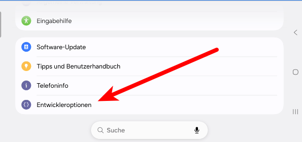
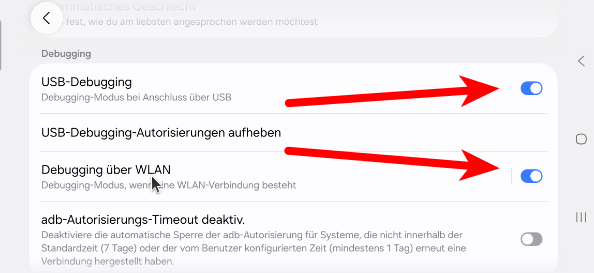
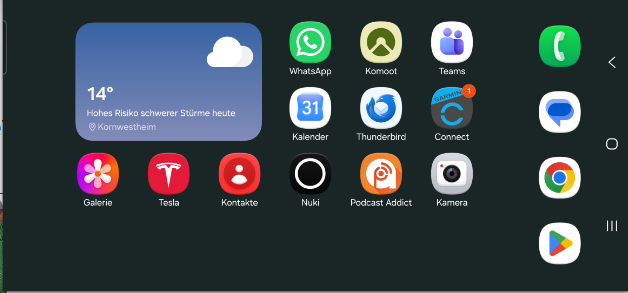

+++
date = '2026-06-01'
draft = false
title = 'SCRCPY - Telefon-Bedienung auf dem Linux-Arbeitsplatz'
categories = [ 'Sonstiges' ]
tags = [ 'linux', 'ubuntu' ]
+++

<!--
SCRCPY - Telefon-Bedienung auf dem Linux-Arbveitsplatz
============================
-->

Manchmal ist es lästig, wenn man am Arbeitsplatz
werkelt und dann das Telefon bedienen muß.
Mittels SCRCPY kann man sich die Telefon-Oberfläche
in einem Fenster anzeigen lassen und bedienen.

<!--more-->

Zusatzpakete installieren
-------------------------

```
sudo apt install adb
  # ii  adb            1:34.0.4-1build3 amd64        Android Debug Bridge
```

SCRCPY herunterladen und einspielen
-----------------------------------

- Herunterladen von [scrcpy-linux-x86_64-v4.0.tar.gz](https://github.com/Genymobile/scrcpy/releases/download/v4.0/scrcpy-linux-x86_64-v4.0.tar.gz)
- Virenscan
- Auspacken: `gzip -cd scrcpy-linux-x86_64-v4.0.tar.gz|tar xf -`

Telefon: USB-Debugging aktivieren
---------------------------------

Auf dem Telefon muß USB-Debugging aktiviert werden.
Bei Samsung geht das via der Telefon-Konfiguration:

- Telefon-Konfiguration öffnen
- Entwickleroptionen

  

- USB-Debugging aktivieren (optional auch "Debugging über WLAN")

  

Telefon: Per USB-Kabel mit Arbeitsplatzrechner verbinden
--------------------------------------------------------

Bitte melden, falls unklar ist wie man das macht!

SCRCPY starten und Zugriff genehmigen
-------------------------------------

```
scrcpy
```

Mit meinem Samsung-Telefon klappt das erstmal nicht.
In der Konsole erscheint eine Fehlermeldung wie diese:

```
scrcpy 4.0 <https://github.com/Genymobile/scrcpy>
* daemon not running; starting now at tcp:5037
* daemon started successfully
ERROR: Device is unauthorized:
ERROR:     -->   (usb)  R5CW113VV9Y               unauthorized  
ERROR: A popup should open on the device to request authorization.
ERROR: Check the FAQ: <https://github.com/Genymobile/scrcpy/blob/master/FAQ.md>
ERROR: Server connection failed
```

Auf dem Telefon wird ein Abfragedialog angezeigt zur Genehmigung
des Zugriffs. Diesen erlauben und SCRCPY nochmal starten - nun
klappt es!



Versionen
---------

- Getestet unter Ubuntu-2404

Links
-----

- [SCRCPY: Android Screen Mirroring Tool](https://scrcpy.org/)
- [scrcpy-linux-x86_64-v4.0.tar.gz](https://github.com/Genymobile/scrcpy/releases/download/v4.0/scrcpy-linux-x86_64-v4.0.tar.gz)

Historie
--------

- 2026-06-01: Erste Version
