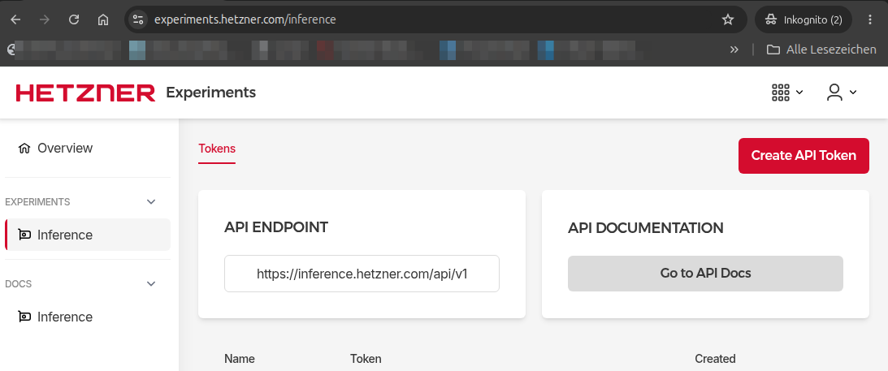
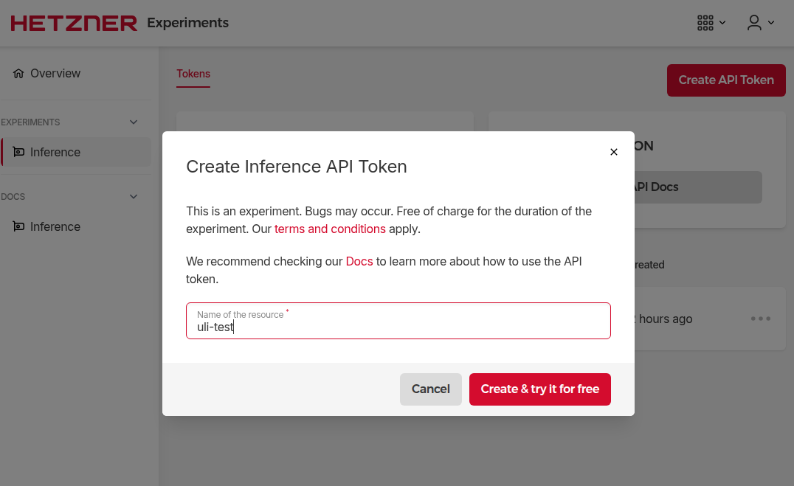
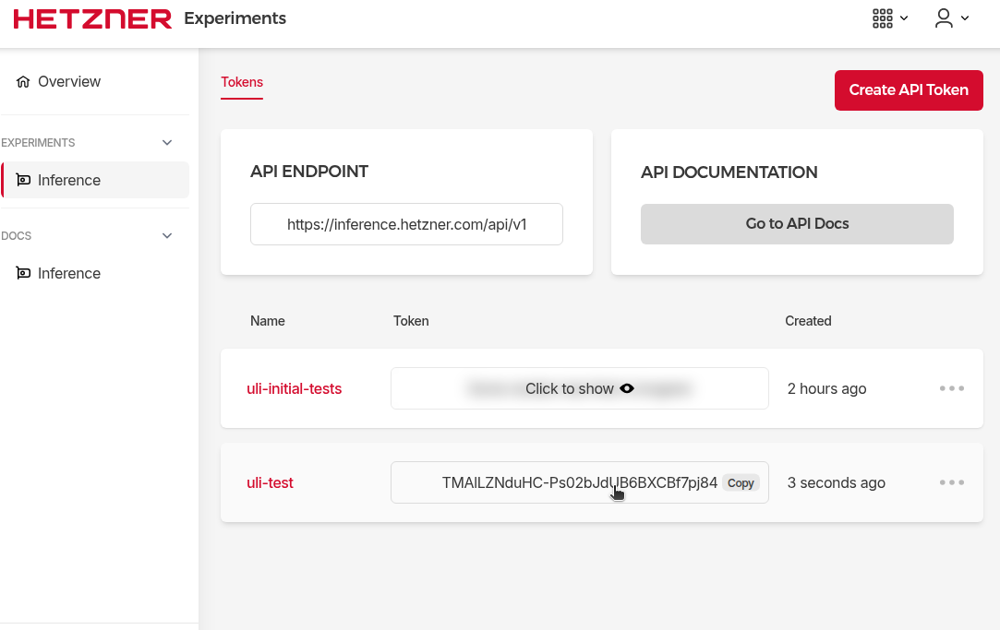

+++
date = '2026-09-08'
draft = false
title = 'OPENCODE: Tests mit dem Hetzner-Experiment "inference"'
categories = [ 'KI' ]
tags = [ 'opencode' ]
+++

<!--
OPENCODE: Tests mit dem Hetzner-Experiment "inference"
===================================
-->

Bei Hetzner gibt es ein "Experiment" mit dem Namen "inference".
Wie es aussieht, kann man damit Qwen3.8-27B mit einem OpenAI-kompatiblen
API verwenden. Mal sehen, ob's klappt!

<!--more-->

Voraussetzungen
---------------

Für die nachfolgende Beschreibung gelten folgende Voraussetzungen:

- Wir haben einen laufenden INCUS-Container mit Ubuntu-26.04
- Der Container hat Zugriff in's Internet
- Darin ist die neueste Version von OpenCode installiert (1.18.29 zum aktuellen Zeitpunkt)
- OpenCode kann im Container gestartet werden mit `opencode`

Ein ähnliches Setup habe ich früher schonmal für COPILOT verwendet
und detailliert beschrieben: [Copilot-CLI in einem Container]().

Hetzner
-------

Beim [Hetzner-Experiment "inference"](https://experiments.hetzner.com/inference)
kann man sich mit seinem Hetzner-Nutzer anmelden
und dann ein API-Token erzeugen:







Bei mir lautet das AI Token "TMAlLZNduHC-Ps02bJdUB6BXCBf7pj84".

OpenCode
--------

1. Anmelden am Container: `ssh ubuntu@opencode.hostonly.domain`
2. OpenCode starten: `opencode` -> Tip Run /connect to add an AI provider and start coding
3. Verbinden mit Hetzner:
   ```
   /connect
   Search: hetzner <ENTER>
   API key: TMAlLZNduHC-Ps02bJdUB6BXCBf7pj84 <ENTER>
   Qwen3.8-27B <ENTER>
   ```

Danach kann es losgehen! Das war ja einfach!

Test
----

### Anfrage

create a springboot command line application using gradlew for the build. Use the latest and                                                
greatest of all used components.

### Ergebnis

Das Ergebnis sieht vielversprechend aus. Etwas erschreckend ist, wie stark der Container
dabei modifiziert wird (u.a. wird jdk-26 nachinstalliert ohne Rückfrage).

### Verbesserungswunsch

io.spring.dependency-management mag ich nicht. verwende besser das springboot bom

### Endergebnis

Danach sieht's richtig gut aus!

### Gesamtprotokoll

Das gesamte Protokoll der OpenCode-Session findet sich hier: [opencode-console.md]().

### Endergebnis

Das Endergebnis findet sich hier im Unterordner "[springboot](springboot/)"
oder im ZIP "[springboot.zip](springboot.zip)" zum herunterladen.

Vergleich mit Copilot/Auto/ClaudeSonnet5
----------------------------------------

Dieselbe Aufgabe habe ich auch mit Copilot bearbeitet.
Das Ergebnis sieht vergleichbar aus, inklusive Verwendung vom
Dependency-Management-Plugin.

Auffälligkeiten:

- Copilot ist gefühlt schneller (Faktor 2?)
- Copilot verwendet Java-25, bei Hetzner ist es Java-26
- Copilot stellt viele Rückfragen; gefühlt wird nichts gemacht, ohne dass ich als Nutzer es "genehmige"

Das Endergebnis findet sich hier im Unterordner "[springboot-copilot](springboot-copilot/)"
oder im ZIP "[springboot-copilot.zip](springboot-copilot.zip)" zum herunterladen.

Das gesamte Protokoll der Copilot-Session findet sich hier: [copilot-console.md]().

Links
-----

- [Copilot-CLI in einem Container]()
- [OpenCode-1.18.29](https://github.com/anomalyco/opencode/releases/download/v1.18.29/opencode-linux-x64.tar.gz)
- [Hetzner Experimente](https://experiments.hetzner.com/)
- [Hetzner Experimente - Inference](https://experiments.hetzner.com/inference)

Versionen
---------

Getestet mit

- Ubuntu 26.04 LTS
- incus-7.0.1
- Opencode 1.18.29

Historie
--------

- 2026-09-09: Vergleich mit Copilot aufgenommen, Verweise auf *-console.md korrigiert
- 2026-09-08: Erste Version
