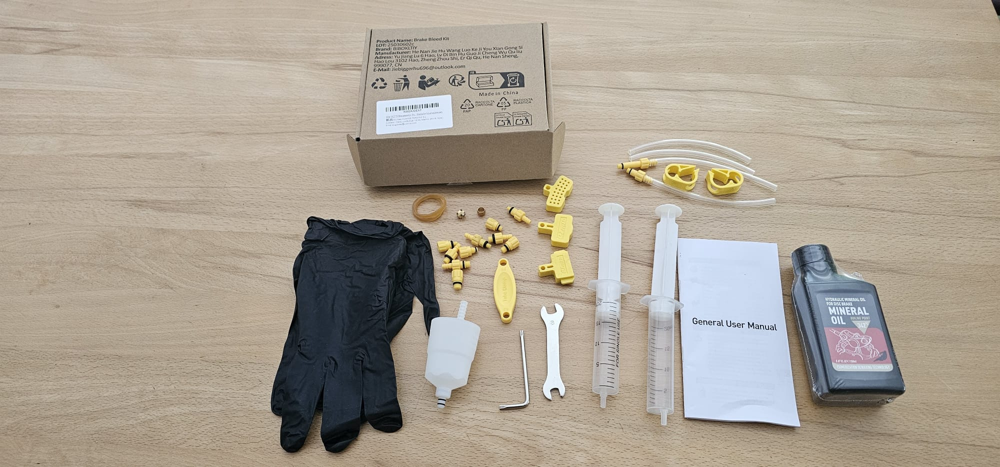
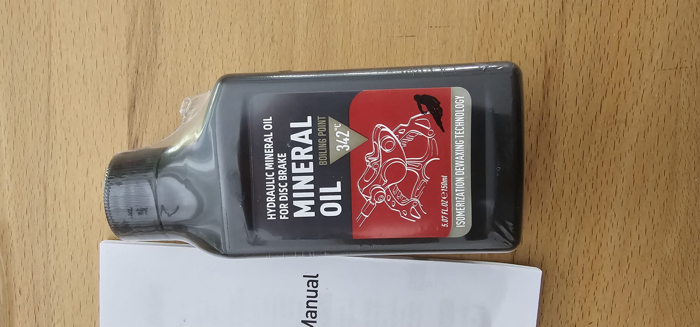

+++
date = '2026-08-01'
draft = false
title = 'Kleinanzeigen - Bremsentlüftung'
#categories = [ 'Hugo' ]
#tags = [ 'hugo', 'mainroad' ]
+++

<!--
Kleinanzeigen - Bremsentlüftung
===================
-->

Anzeige
-------

**Entlüftungskit für Scheibenbremsen**

Ich möchte mich von meinem Entlüftungskit für Fahrradbremsen
trennen. Ich habe es im letzten Sommer gekauft und vor ein
paar Wochen verwendet, um meine SRAM Rival Scheibenbremse zu entlüften.
Das hat "im Prinzip" funktioniert. Ich konnte danach problemlos meinen
Alpencross absolvieren, die Bremse hatte den üblichen Druckpunkt und
keinerlei Probleme.

Leider war das Entlüften selbst insgesamt eine Riesensauerei.
Ich habe in meiner Werkstatt mehrmals mit der Bremsflüssigkeit
"rumgesaut":

- Gemäß manchen Anleitungen soll man mit den Spritzen einen Überdruck
  aufbauen -> wenn man da zu schusselig ist, dann "zieht" es einen
  Schlauch ab und schon fliegt die Flüssigkeit durch die Gegens

- Bei den Rival-Bremsen gibt es keine "Sperrschraube" (keine Ahnung,
  was der genaue Fachbegriff ist). Wenn man mit dem Entlüften durch
  ist, dann soll man den Schlauch abziehen und die Dichtungsschraube
  anbringen -> wenn man mit dem Überdruck zu ambitioniert ist, dann
  sprizt beim Abziehen auch die Flüssigkeit durch die Gegend

Ich habe danach nun beschlossen, dass ich das künftig besser in
der Werkstatt machen lasse. Das Entlüftungskit brauche ich
damit nicht mehr.

Das Kit enthält viele Kleinteile - siehe Foto. Ich denke, es geht
auch für Shimano und andere Bremsen. Das Hydrauliköl ist noch
verschweißt und damit ungebraucht. SRAM verwendet ja Bremsflüssigkeit,
für das Öl hatte ich dementsprechend keinerlei Verwendung.

Gerne nehme ich Kaufangebote entgegen. Idealerweise klappt ein Verkauf in den kommenden 2 Wochen, also grob bis Mitte/Ende August.

Garantie kann ich keine übernehmen, Mängel sind mir keine bekannt.
Der Artikel ist einmalig benutzt. Habe ihn danach gründlich ausgewaschen,
sollte also quasi neuwertig sein. Handschuhe und Bremsöl sind unbenutzt.

[Amazon-Link](https://www.amazon.de/dp/B0F18F3GQQ/ref=sspa_dk_detail_1?psc=1&pd_rd_i=B0F18F3GQQ&pd_rd_w=xT8F5&content-id=amzn1.sym.cf5ead54-c2f4-4493-953a-430e94cae639&pf_rd_p=cf5ead54-c2f4-4493-953a-430e94cae639&pf_rd_r=G0SB8PKNASB1WE9ZZNN6&pd_rd_wg=aTEqI&pd_rd_r=da521ea3-73cc-4217-8ae9-9c68da9350f6&aref=udvuSRrD9x&sp_csd=d2lkZ2V0TmFtZT1zcF9kZXRhaWw)

Historie
--------

- 2026-08-01: Erste Version
