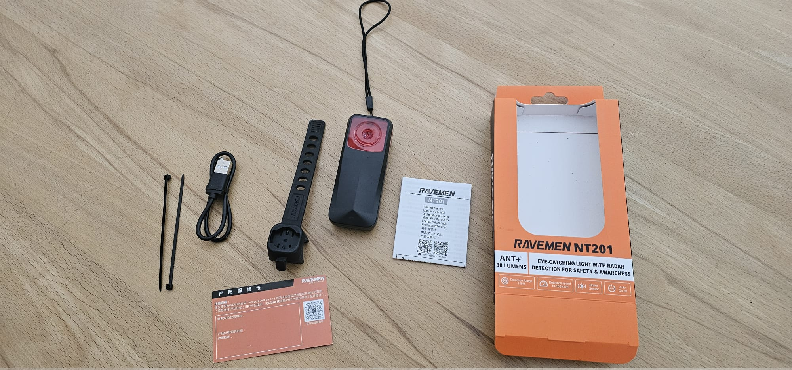

+++
date = '2026-08-01'
draft = false
title = 'Kleinanzeigen - Ravemen NT201'
#categories = [ 'Hugo' ]
#tags = [ 'hugo', 'mainroad' ]
+++

<!--
Kleinanzeigen - Ravemen NT201
===================
-->

Anzeige
-------

**Fahrrad Radarrücklicht - Ravemen NT201**

Ich habe hier ein Ravemen NT201 Fahrradrücklicht und Radar. Ich habe es nie benutzt. Grob ist das Teil wohl ähnlich zum Garmin RTL516. Man kann es per USB-C aufladen. Koppeln kann man's mit gängigen Radcomputern wie die von Garmin oder Wahoo.

Warum habe ich es nie benutzt?

- Mein altes Garmin 716 war lange "gut genug"
- Das Ravemen hat eine spezielle Halterung - sieht grob aus wie die Garmin-Halterung, ist aber kleiner
- Mittlerweile bin umgestiegen auf ein Radarlicht von Sigma, das ist kompatibel mit Garmin-Halterungen

Gerne nehme ich Kaufangebote entgegen. Idealerweise klappt ein Verkauf in den kommenden 2 Wochen, also grob bis Mitte/Ende August.

Garantie kann ich keine übernehmen, Mängel sind mir keine bekannt außer dass ich die Verpackung geöffnet habe und nun nur noch den "Außenkarton" habe.

Historie
--------

- 2026-08-01: Erste Version
