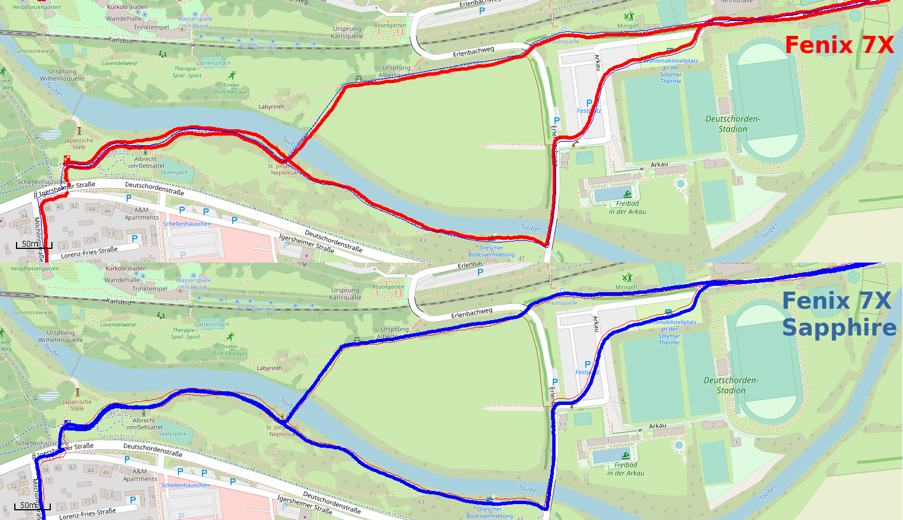
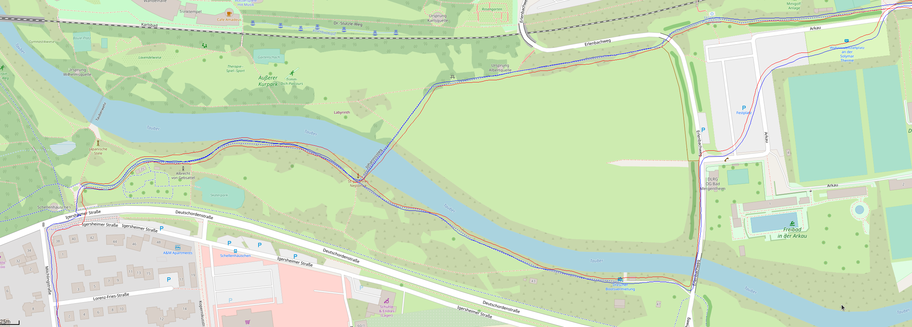

2022-02-05 - Fenix 7X und Fenix 7X Sapphire
===========================================

Noch ein weiterer Lauf in Bad Mergentheim, diesmal eine
ganz andere Strecke und mit 7X (rechts, eingestellt in GarminConnect: links) und 7X Sapphire (links):

Das Stück links bin ich hin und zurück gleich gelaufen. Die 7X Sapphire schafft es, da eine überlappende Strecke aufzuzeichnen.

Bin von links unten in die Strecke reingelaufen und dann gleich über die Brücke.
Man sieht, dass der rote Kurs immer rechts vom blauen verläuft. Der blaue läuft
für mich ein klein wenig genauer auf dem Weg. Das sind aber wirklich Details.

Bin dann oben rechts aus dem Bild gelaufen und knapp 10km später dann da auch wieder zurückgekommen.
Wieder sieht man rot=rechts von blau.

- [GPX-Track Garmin 7X](data/2022-02-05_2_7x.gpx.xz)
- [GPX-Track Garmin 7X Sapphire](data/2022-02-05_2_7x-sapphire.gpx.xz)
