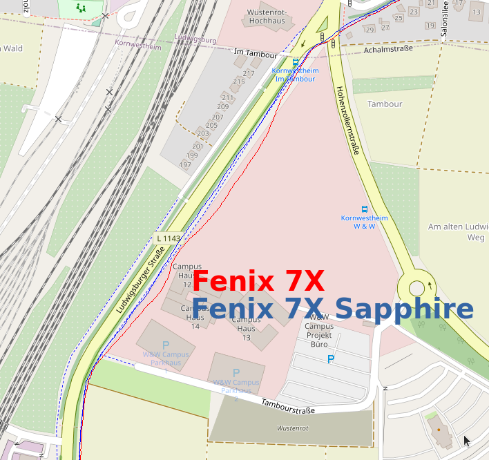

2022-02-09 - Fenix 7X und Fenix 7X Sapphire
===========================================

Noch ein weiterer Lauf in Kornwestheim über die Felder Richtung Neckar.

7X am **linken** Handgelenk auf links eingestellt, 7X Sapphire am **rechten** auf rechts eingestellt.

Beide Uhren liefern quasi deckungsgleiche Strecken, die 7X Sapphire immer etwas rechts von der 7X.
Es gibt auf der ganzen Strecke nur eine Stelle mit etwas größerer Abweichung und die sieht man oben
im Bild. Real bin uch auf dem Weg entlang der Allee gelaufen. Das rote Gebiet ist mittlerweile bebaut
mit grob 6-stöckigen Gebäuden. Eventuell haben die den GPS-Empfang etwas gestört?

- [GPX-Track Garmin 7X](data/2022-02-09_7x.gpx.xz)
- [GPX-Track Garmin 7X Sapphire](data/2022-02-09_7x-sapphire.gpx.xz)
