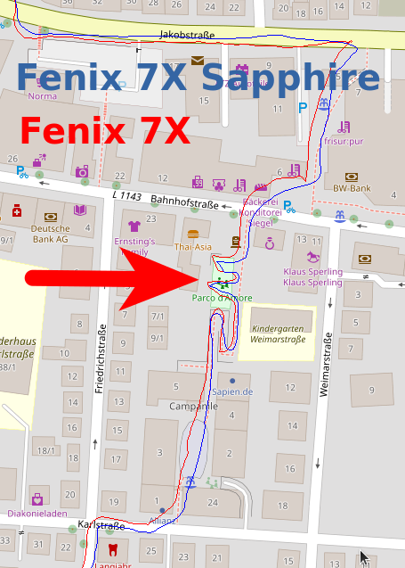

2022-02-10 - Parco d'Amore - Fenix 7X und Fenix 7X Sapphire
===========================================================

Noch ein weiterer Lauf in Kornwestheim im Stadtgebiet.
Ich laufe jetzt und künftig wieder mit meiner Standardvariante:
7X Sapphire am linken Handgelenk auf links eingestellt, 7X am rechten auf rechts eingestellt.

Beide Uhren liefern quasi deckungsgleiche Strecken,
auch die Bewegungen innerhalb des Miniparks werden sehr
genau aufgezeichnet!

- [GPX-Track Garmin 7X](data/2022-02-10_7x.gpx.xz)
- [GPX-Track Garmin 7X Sapphire](data/2022-02-10_7x-sapphire.gpx.xz)
