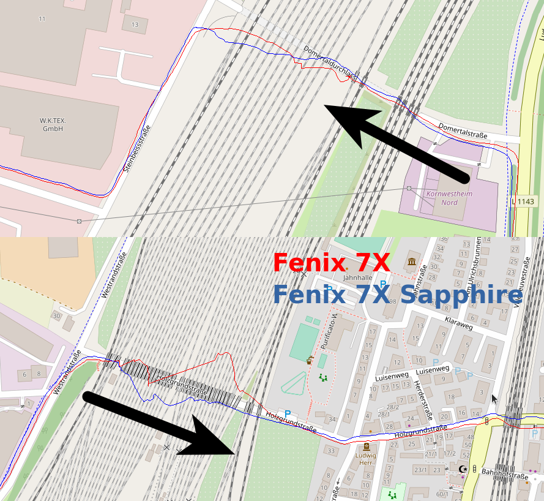

2022-02-13 - Eisenbahnunterführungen - Fenix 7X und Fenix 7X Sapphire
===================================================================

Noch ein weiterer Lauf in Kornwestheim im Stadtgebiet
und über die Felder. Wieder die Standardvariante:
7X Sapphire am linken Handgelenk auf links eingestellt, 7X am rechten auf rechts eingestellt.

Ich bin durch 2 verschiedene Unterführungen gelaufen. Laufrichtung ist mit schwarzem Pfeil markiert.
Beide Uhren haben dort Schwächen, kein klarer Sieger!

- [GPX-Track Garmin 7X](data/2022-02-13_7x.gpx.xz)
- [GPX-Track Garmin 7X Sapphire](data/2022-02-13_7x-sapphire.gpx.xz)
