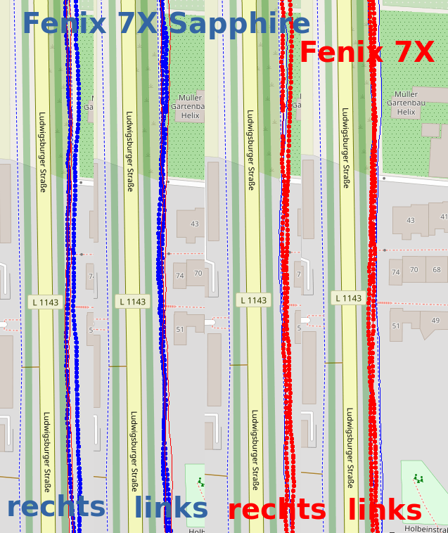

Ludwigsburger Allee
===================

Bei meinen Läufen gestern und heute
bin ich unter anderem die Ludwigsburger Allee
gelaufen, jeweils hin- und zurück.
Am 2022-02-20 habe ich

- die 7X Sapphire links
- die 7X rechts

getragen, am 2022-02-21 genau umgekehrt. Bei der 7X Sapphire ist "Multiband"
aktiviert.

Bezüglich der Genauigkeit stelle ich quasi keinen Unterschied fest.
Beide Uhren sehen "links" supergenau aus, "rechts" etwas ungenauer.

Wobei: Wenn ich "hin" am rechten Wegesrand laufe und zurück ebenfalls (=also
auf der anderen Seite), dann **müssen** die Aufzeichnungen der rechten Uhr
weiter auseinander liegen als die der linken. Also: Alles gut!

- [GPX-Track Garmin 7X rechts](data/2022-02-20_7x.gpx.xz)
- [GPX-Track Garmin 7X links](data/2022-02-21_7x.gpx.xz)
- [GPX-Track Garmin 7X Sapphire links](data/2022-02-20_7x-sapphire.gpx.xz)
- [GPX-Track Garmin 7X Sapphire rechts](data/2022-02-21_7x-sapphire.gpx.xz)
