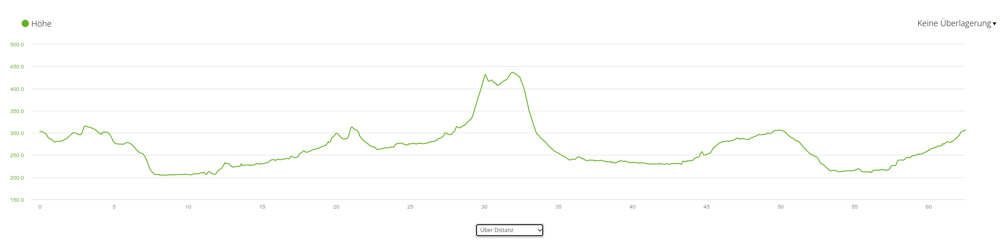
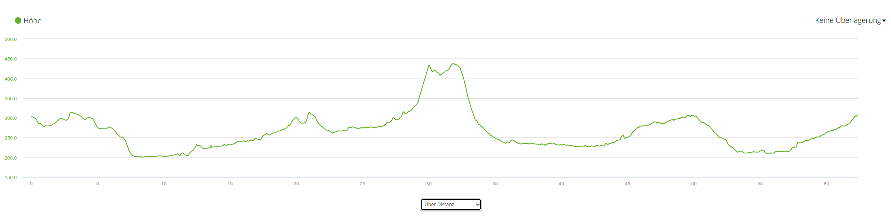
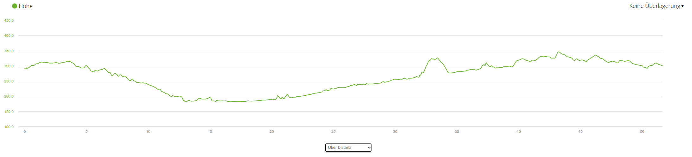
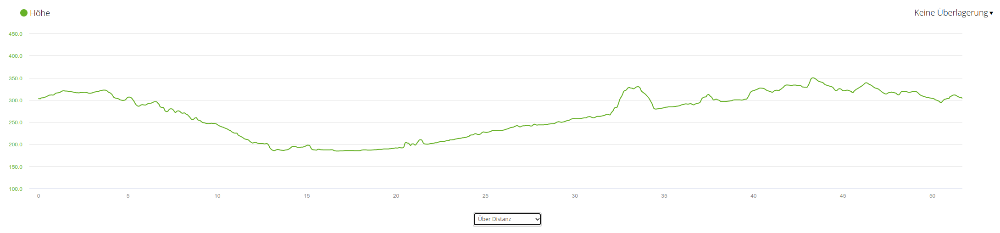
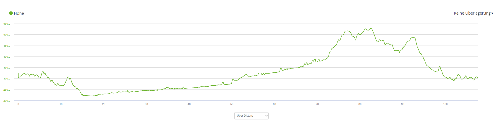
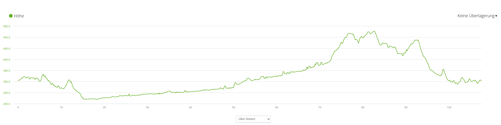

Höhenmeter-Abweichung zwischen Marq2 und Edge 1040
==================================================

Seit ein paar Wochen nutze ich als primäre Uhr eine Marq2.
Kürzlich habe ich wieder mit dem Radeln begonnen. Erste Touren
nur mit der Uhr haben sich nicht bewährt. Es dauert einfach
zu lange, während der Fahrt den Ärmel hochzukrempeln und
dann die gewünschten Anzeigen abzulesen. Eigentlich müßte man
ein Stück freihändig fahren, das ist mir auf die Dauer
aber zu gefährlich.

Also habe ich mir für's Radeln ein Garmin Edge 1040 Solar zugelegt.
Das Teil gefällt mir echt gut. Ein paar Macken hat es,
wahrscheinlich werde ich die "irgendwann mal" beschreiben.

Ein "Problem" habe ich eben entdeckt: Die kumulierten Höhenmeter
von aufgezeichneten Aktivitäten weichen zwischen der Marq2 und
dem Edge 1040 Solar stark ab. Heute bin ich beispielsweise
60 km weit geradelt. Die Marq2 meint es waren grob 600 Höhenmeter,
das Edge 1040 Solar hingegen gibt grob 700 Höhenmeter an.

Etwas mehr Details zur Tour sowie die "Höhenlinien-Kurven"
finden sich unten. Aus meiner Sicht sehen die Kurven ziemlich
gleichartig aus, die Abweichung von 15% ist dort nicht zu erkennen!

Hat jemand eine Idee, woran das liegen könnte? Die Uhr hatte
ich am Arm (oft unter dem Jackenärmel), das Edge 1040 war
am Lenker montiert.

----------

Gestern nochmal geradelt, grob 50km. Marq2 ist nun bei "Datenaufzeichnung" geändert von "intelligent" auf "1 Sekunde". Für mich sieht es insgesamt OK aus:

- 2023-03-25: 60km - Marq2(intelligent): 628.3m Edge1040: 720m
- 2023-03-27: 50km - Marq2(1Sekunde): 439.6m Edge1040: 407m

Also: Grob 8% Abweichung in die andere Richtung.

Die Abweichung mit Komoot scheint sich auch zu klären: Wenn ich mir heute die Touren vom 25. ansehe, dann stimmen
die Komoot-Höhenmeter ziemlich genau mit den Garmin-Höhenmetern überein. Meine Vermutung wäre, dass Komoot erstmal nur Schätzwerte anzeigt und die dann später genauer nachrechnet.

2023-03-25
----------

### Marq2

- Distanz: 62.48 km
- Höhe
  - Anstieg gesamt: 628.3 m
  - Abstieg gesamt: 625.2 m
  - Minimale Höhe: 204.2 m
  - Maximale Höhe: 436.8 m

### Edge 1040 Solar

- Distanz: 62.39 km
- Höhe
  - Anstieg gesamt: 720 m
  - Abstieg gesamt: 725 m
  - Minimale Höhe: 200.4 m
  - Maximale Höhe: 438.8 m

2023-03-27
----------

### Marq2

- Distanz: 51.65 km
- Höhe
  - Anstieg gesamt: 439.6 m
  - Abstieg gesamt: 430.0 m
  - Minimale Höhe: 181.2 m
  - Maximale Höhe: 345.8 m

### Edge 1040 Solar

- Distanz: 51.68 km
- Höhe
  - Anstieg gesamt: 407.0 m
  - Abstieg gesamt: 405.0 m
  - Minimale Höhe: 184.6 m
  - Maximale Höhe: 349.8 m

2023-04-02
----------

### Marq2

- Distanz: 107.60 km
- Höhe
  - Anstieg gesamt: 886.5 m
  - Abstieg gesamt: 903.0 m
  - Minimale Höhe: 222.2 m
  - Maximale Höhe: 528.4 m

### Edge 1040 Solar

- Distanz: 107.6 km
- Höhe
  - Anstieg gesamt: 942.0 m
  - Abstieg gesamt: 946.0 m
  - Minimale Höhe: 219.6 m
  - Maximale Höhe: 527.8 m

2023-04-04
----------

### Marq2

Etwas zu spät gestartet!

- Distanz: 59.10 km
- Höhe
  - Anstieg gesamt: 799.3 m
  - Abstieg gesamt: 776.9 m
  - Minimale Höhe: 207.8 m
  - Maximale Höhe: 492.8 m

### Edge 1040 Solar

- Distanz: 60.33 km
- Höhe
  - Anstieg gesamt: 845.0 m
  - Abstieg gesamt: 848.0 m
  - Minimale Höhe: 211.6 m
  - Maximale Höhe: 503.4 m

2023-04-05
----------

### Marq2

- Distanz: 31.68 km
- Höhe
  - Anstieg gesamt: 317.5 m
  - Abstieg gesamt: 322.1 m
  - Minimale Höhe: 231.8 m
  - Maximale Höhe: 345.8 m

### Edge 1040 Solar

- Distanz: 31.69 km
- Höhe
  - Anstieg gesamt: 298.0 m
  - Abstieg gesamt: 302.0 m
  - Minimale Höhe: 232.2 m
  - Maximale Höhe: 347.0 m

2023-04-09
----------

### Marq2

- Distanz: 97.34 km
- Höhe
  - Anstieg gesamt: 1206.1 m
  - Abstieg gesamt: 1207.6 m
  - Minimale Höhe: 192.6 m
  - Maximale Höhe: 482.0 m

### Edge 1040 Solar

- Distanz: 97.35 km
- Höhe
  - Anstieg gesamt: 1228.0 m
  - Abstieg gesamt: 1261.0.0 m
  - Minimale Höhe: 193.0 m
  - Maximale Höhe: 483.8 m

2023-04-16
----------

### Marq2

- Distanz: 97.34 km
- Höhe
  - Anstieg gesamt: 1109.6 m
  - Abstieg gesamt: 904.8 m
  - Minimale Höhe: 286.8 m
  - Maximale Höhe: 600.6 m

### Edge 1040 Solar

- Distanz: 101.81 km
- Höhe
  - Anstieg gesamt: 1086.0 m
  - Abstieg gesamt: 893.0 m
  - Minimale Höhe: 287.4 m
  - Maximale Höhe: 604.2 m
