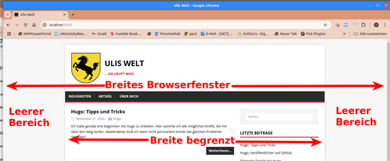
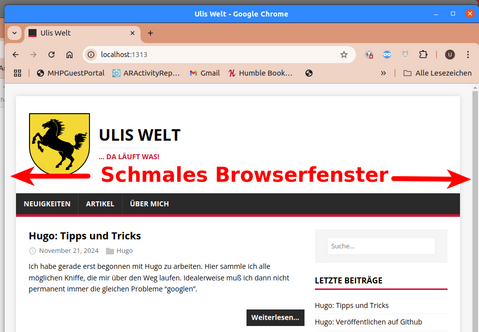

+++
date = '2024-11-22'
draft = true
title = 'Hugo: Breitenlimitierung aufheben'
categories = [ "Hugo" ]
+++

<!--
Hugo: Breitenlimitierung aufheben
=================================
-->

Meine Webseite verhält sich aus meiner Sicht ungünstig,
wenn man das Browserfenster verbreitert. Es wird dann links
und rechts ein leerer Bereich eingeblendet. Der Nutztext
bleibt schmal, links und rechts gibt es einen leeren Bereich.



<!--more-->

Anzeige in einem schmalen Browserfenster
----------------------------------------

Bei einem verhältnismässig schmalen Browserfenster passt
die Darstellung halbwegs: Außen rum ein schmaler Rand, Text
nimmt fast das gesamte Browser-Fenster ein:



Anzeige in einem breiten Browserfenster
---------------------------------------

Wenn man das Browserfenster in die Breite zieht, so wird
der Text zunächst auch breiter. Ab einem bestimmten Punkt
friert dessen Breite aber ein und es werden links und
rechts leere Bereiche eingefügt:


Ich bin mir durchaus bewußt, dass das dem übliche Vorgehen
entspricht. Mir persönlich gefällt es aber überhaupt nicht.
Für mich ist das Platzverschwendung!

Aufhebung der Breitenlimitierung
--------------------------------

Über die Browser-Funktion "Rechtsklick - Untersuchen" habe
ich die Darstellung gesichtet. Dabei ist mir aufgefallen,
dass die Breite des Textbereichs auf "1080px" begrenzt ist.
Danach habe ich dann im Unterverzeichnis "themes/mainroad"
gesucht und die Limitierung entfernt:

```diff
--- my-hugo-site/themes/mainroad/assets/css/style.css ---
index 651a2c7..a64bc86 100644
@@ -62,7 +62,7 @@ body {
 .container {
 	position: relative;
 	width: 100%;
-	max-width: 1080px;
+	/*max-width: 1080px;*/
 	margin: 0 auto;
 }
```

Historie
--------

- 2024-11-22: Erste Version
