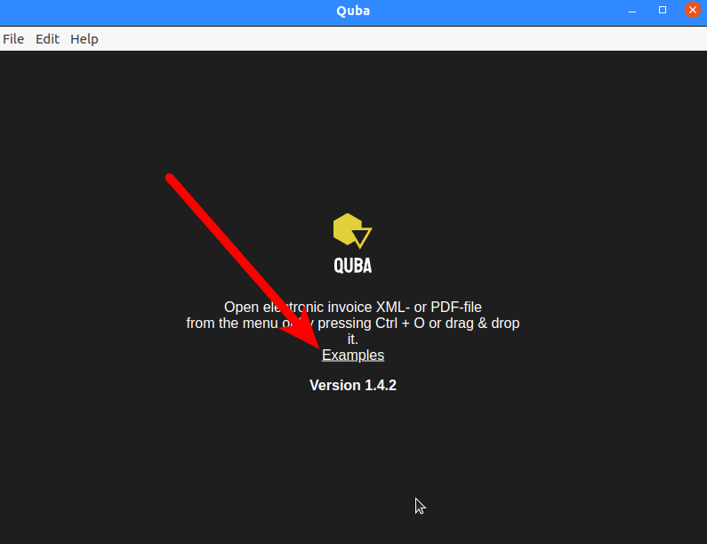
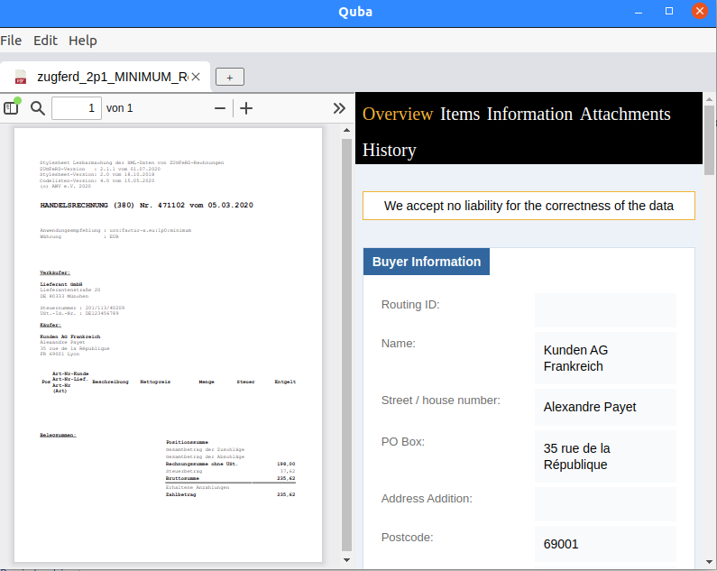
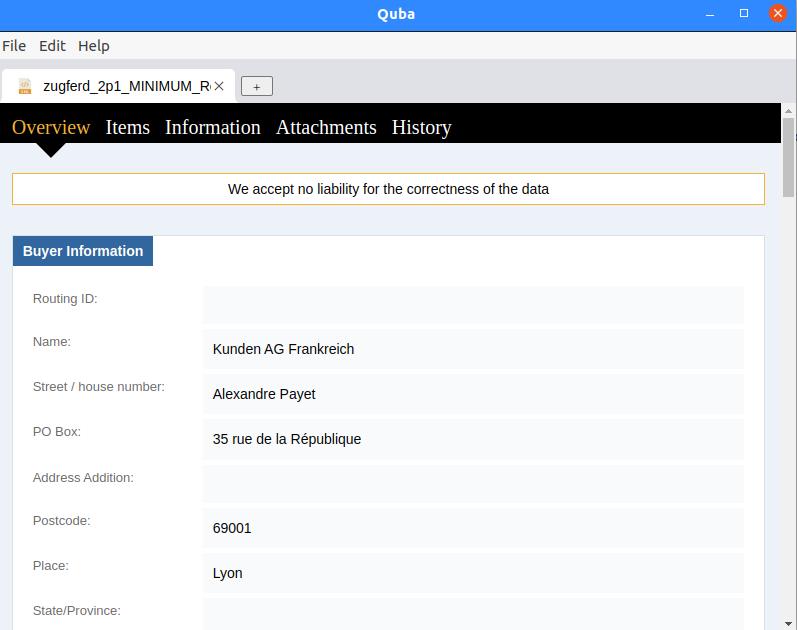

+++
date = '2024-12-20'
draft = false
title = 'E-Rechnung lesen mit Quba'
categories = [ 'E-Rechnung' ]
tags = [ 'e-rechnung', 'buchhaltung' ]
+++

<!--
E-Rechnung lesen mit Quba
=========================
-->

Vorweg: Ich bin kein Rechtsanwalt. Wenn ich hier Vorschriften
beschreibe, so sind das meine Laieninterpretationen.
Ich würde mich nicht zwingend auf die Richtigkeit verlassen!

Ab dem 1.1.2025 sind Unternehmen verpflichtet,
E-Rechnungen entgegennehmen zu können. Im Wesentlichen reicht
dafür technisch ein Email-Postfach aus. Also sowas wie
"buchhaltung@meine-firma.de". So weit, so einfach.

Was ist zu tun, wenn nun tatsächlich jemand eine E-Rechnung
dorthin schickt?

<!--more-->

Beispielrechnungen
------------------

Eine Beispielrechnung findet sich hier:

- [zugferd_2p1_MINIMUM_Rechnung.pdf](https://github.com/ZUGFeRD/quba-viewer/blob/master/000resources/testfiles/zugferd_2p1_MINIMUM_Rechnung.pdf)
- [zugferd_2p1_MINIMUM_Rechnung.xml](https://github.com/ZUGFeRD/quba-viewer/blob/master/000resources/testfiles/zugferd_2p1_MINIMUM_Rechnung.xml)

Mehr Beispiele: [Verzeichnis mit Testdateien](https://github.com/ZUGFeRD/quba-viewer/tree/master/000resources/testfiles)

Empfang einer E-Rechnung im PDF-Format
--------------------------------------

Eine E-Rechnung im PDF-Format sieht bspw. so aus: [zugferd_2p1_MINIMUM_Rechnung.pdf](https://github.com/ZUGFeRD/quba-viewer/blob/master/000resources/testfiles/zugferd_2p1_MINIMUM_Rechnung.pdf)

Wenn man eine E-Rechnung im PDF-Format empfängt, dann kann man sich
"dumm stellen" und sie einfach mit den üblichen PDF-Betrachterprogrammen
untersuchen und bearbeiten. Typischerweise wird es kein Problem geben.

ABER: Wenn der Rechnungssteller Mist baut, dann weicht der PDF-Teil vom
E-Rechnungs-Teil ab. Meinem Verständnis nach ist künftig der E-Rechnungsteil
verbindlich. Man muß im Zweifel also die Beträge des E-Rechnungsteils begleichen
und nicht die PDF-Beträge. In einem üblichen PDF-Betrachterprogramm sieht
man diese nicht.

Empfang einer E-Rechnung im XML-Format
--------------------------------------

Eine E-Rechnung im XML-Format sieht bspw. so aus: [zugferd_2p1_MINIMUM_Rechnung.xml](https://github.com/ZUGFeRD/quba-viewer/blob/master/000resources/testfiles/zugferd_2p1_MINIMUM_Rechnung.xml)

Man kann sie bspw. mit einem Dateieditor wie `vi` öffnen und sichten.
Das ist sehr unkomfortabel und fehlerträchtig!

Sichtung von E-Rechnungen mit Quba
----------------------------------

Glücklicherweise gibt es mit [Quba-Viewer](https://quba-viewer.org/) ein Anzeigeprogramm für elektronische Rechnungen.

Ich habe für meine Tests die AppImage-Version heruntergeladen
und gestartet. Nach dem Start erhält man eine Maske wie diese:

Der "rote Pfeil" zeigt den Weg zu Beispieldateien.

Eine PDF-Datei mit enthaltener E-Rechnung sieht in Quba so aus:

Links sieht man die PDF-Darstellung analog zu einem PDF-Betrachter.
Rechts die E-Rechnung.

Bei einer XML-Datei sieht's so aus:

Ich denke, damit kann man klarkommen.

Offene Punkte
-------------

- Wie "verlässlich" ist Quba? Bei der Anzeige steht ja immer groß dran "keine Gewährleistung"...
- Wie sichert man sich gegen falsche Rechnungen? "Theoretisch" kann einem ja "jeder" solche Rechnungen schicken.
  Wenn derjenige dann "richtige" Firmen immitiert - wie bspw. die Telekom oder Vodafone - dann können
  leicht Fehlbuchungen erfolgen!

Versionen
---------

Getestet mit Ubuntu Linux 20.04
und Quba-1.4.2.

Links
-----

- [Quba-Viewer - Webseite](https://quba-viewer.org/) - Anzeigeprogramm für elektronische Rechnungen
- [Quba-Viewer - Github](https://github.com/ZUGFeRD/quba-viewer)
  - Beispielrechnung PDF: [zugferd_2p1_MINIMUM_Rechnung.pdf](https://github.com/ZUGFeRD/quba-viewer/blob/master/000resources/testfiles/zugferd_2p1_MINIMUM_Rechnung.pdf)
  - Beispielrechnung XML: [zugferd_2p1_MINIMUM_Rechnung.xml](https://github.com/ZUGFeRD/quba-viewer/blob/master/000resources/testfiles/zugferd_2p1_MINIMUM_Rechnung.xml)
  - Mehr Beispiele: [Verzeichnis mit Testdateien](https://github.com/ZUGFeRD/quba-viewer/tree/master/000resources/testfiles)
- [Electronic invoices](https://www.mustangproject.org/einvoices/?pk_campaign=quba&pk_source=hp)
- [Beispielrechnungen](https://github.com/ConnectingEurope/eInvoicing-EN16931)
 
Historie
--------

- 2024-12-20: Erste Version
