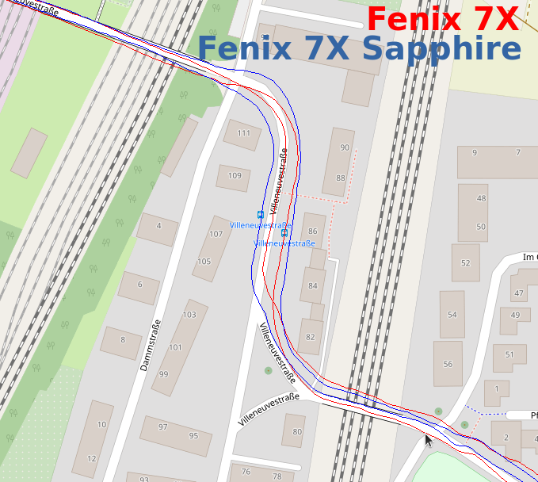

2022-02-08 - Fenix 7X und Fenix 7X Sapphire
===========================================

Noch ein weiterer Lauf in Kornwestheim, diesmal einen Großteil
des Feldweges der Solitudeallee hin und zurück.

7X am rechten Handgelenk auf rechts eingestellt, 7X Sapphire am linken auf links eingestellt.

Über weite Strecken sind beide Uhren beim GPS geichwertig.
Unterschiede sehe ich primär beim Start und Ende des Laufes.
Auf dem Hinweg (=da bin ich auf der linken Strassenseite gelaufen)
scheint die 7X Sapphire genauer, auf dem Rückweg (=andere Strassenseite)
passt die 7X.

- [GPX-Track Garmin 7X](data/2022-02-08_7x.gpx.xz)
- [GPX-Track Garmin 7X Sapphire](data/2022-02-08_7x-sapphire.gpx.xz)
