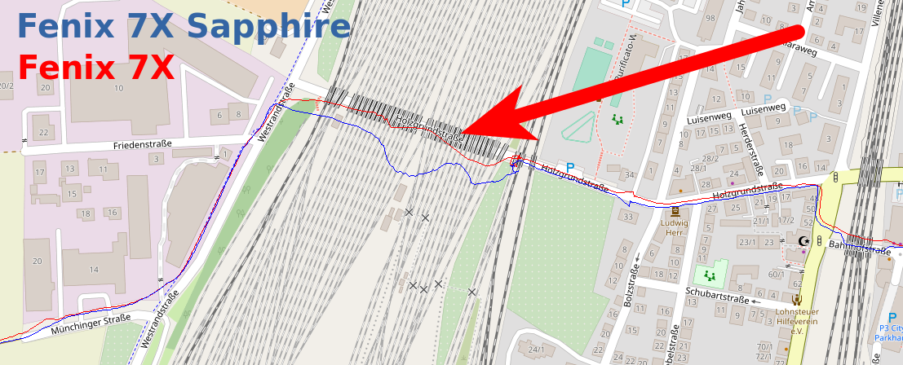

2022-02-11 - Eisenbahnunterführung - Fenix 7X und Fenix 7X Sapphire
===================================================================

Noch ein weiterer Lauf in Kornwestheim im Stadtgebiet
und über die Felder. Wieder die Standardvariante:
7X Sapphire am linken Handgelenk auf links eingestellt, 7X am rechten auf rechts eingestellt.

Bei der Unterführung sieht die 7X deutlich besser aus als die 7X Sapphire!

- [GPX-Track Garmin 7X](data/2022-02-11_7x.gpx.xz)
- [GPX-Track Garmin 7X Sapphire](data/2022-02-11_7x-sapphire.gpx.xz)
