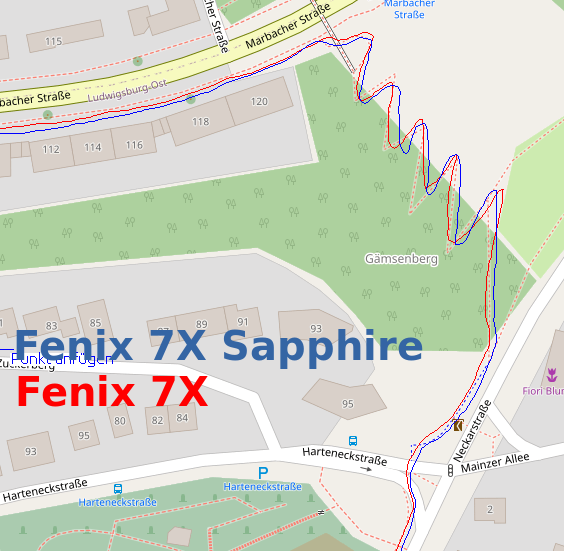
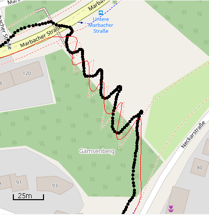
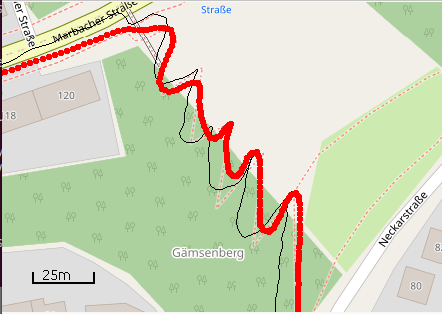
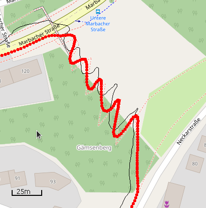

2022-02-12 - Serpentinen - Fenix 7X und Fenix 7X Sapphire
=========================================================

Noch ein weiterer Lauf in Kornwestheim Richtung Ludwigsburg
und dort bergauf die Serpentinenstrecke. Wieder die Standardvariante:
7X Sapphire am linken Handgelenk auf links eingestellt, 7X am rechten auf rechts eingestellt.

Beide Uhren sind ziemlich gleichwertig, beide schneiden die Serpentinen etwas ab!

- [GPX-Track Garmin 7X](data/2022-02-12_7x.gpx.xz)
- [GPX-Track Garmin 7X Sapphire](data/2022-02-12_7x-sapphire.gpx.xz)

## Garmin 6X

## Coros Vertix 2

