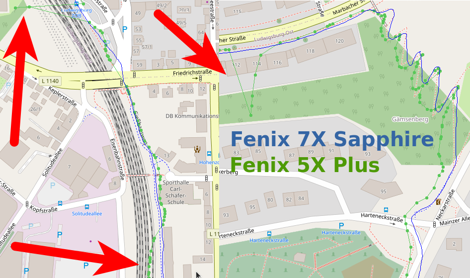

2022-02-14 - Serpentinen - Fenix 5X Plus und Fenix 7X Sapphire
==============================================================

Ein weiterer Lauf in Kornwestheim Richtung Ludwigsburg
und dort bergauf die Serpentinenstrecke.
7X Sapphire am linken Handgelenk auf links eingestellt, 5X Plus am rechten - Handgelenkeinstellung gibt es hier nicht!

Die 5X Plus ist deutlich schlechter. Auf der Strecke sind immer wieder Irrpunkte zu sehen.
Auch eiert der Kurs ziemlich herum. Die Serpentinen sehen auch nicht "schön" aus!

- [GPX-Track Garmin 5X Plus](data/2022-02-14_5x-plus.gpx.xz)
- [GPX-Track Garmin 7X Sapphire](data/2022-02-14_7x-sapphire.gpx.xz)
