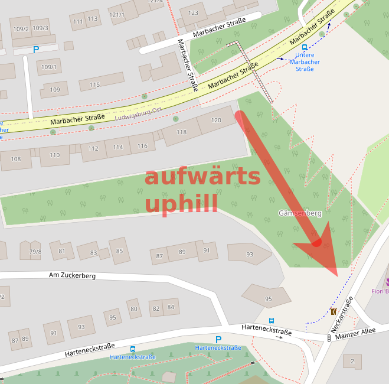
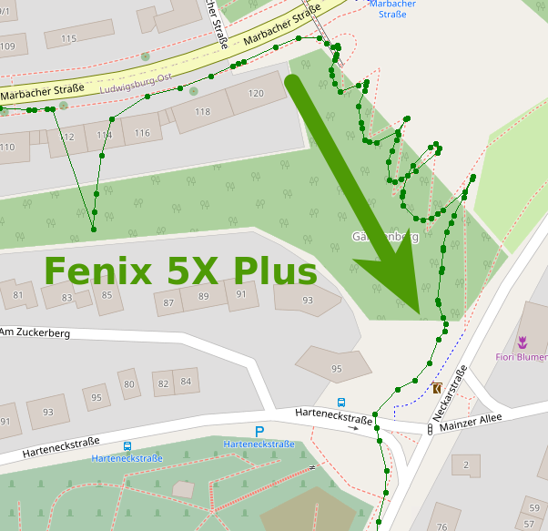
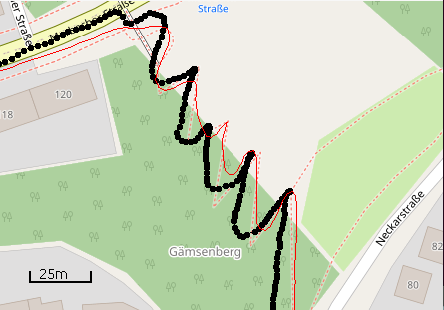
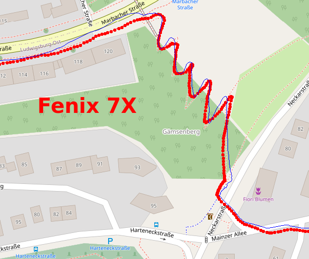
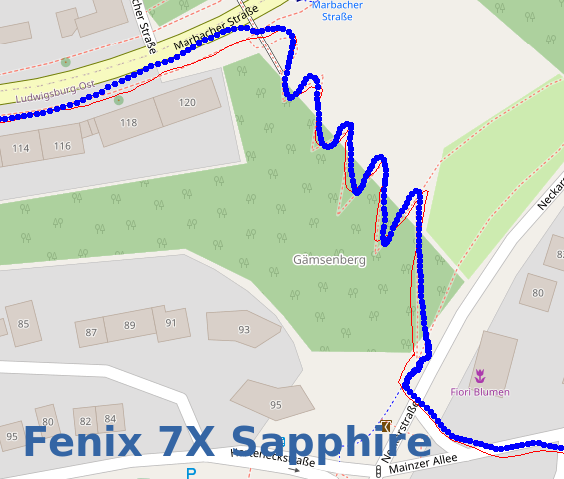
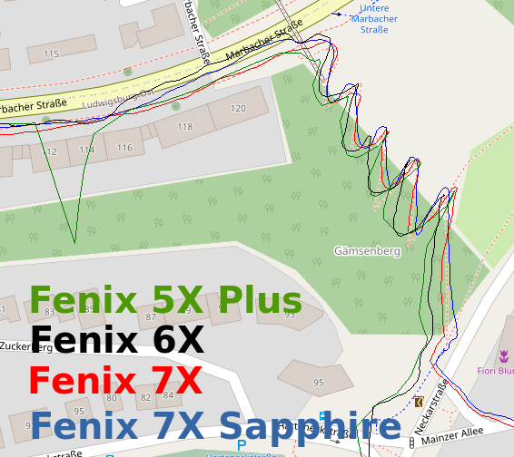

Ludwigsburg Serpentinen
=======================

Ich bin diverse Male die Serpeninenstrecke in Ludwigsburg abgelaufen.
Leider habe ich nicht für alle Läufe die GPX-Dateien gespeichert,
von der Vertix2 gibt es nur Bildschirmfotos.

Die Strecke sieht so aus:

Ich laufe sie immer aufwärts!

## Garmin Fenix 5X Plus

Hier die Aufzeichnung mit der Garmin Fenix 5X Plus:

Es sind einige Sprünge drin und die Serpentinen sehen teilweise wie Kringel aus.
Nicht so supergut!

## Garmin Fenix 6X

## Coros Vertix 2

## Garmin Fenix 7X

## Garmin Fenix 7X Sapphire mit Multiband

## Garmin Fenix 5/6/7

## Tracks

- [GPX-Track Garmin 5X Plus](data/2022-02-14_5x-plus.gpx.xz)
- [GPX-Track Garmin 6X](data/2021-10-08_6x.gpx.xz)
- [GPX-Track Garmin 7X](data/2022-02-20_7x.gpx.xz)
- [GPX-Track Garmin 7X Sapphire](data/2022-02-20_7x-sapphire.gpx.xz)

