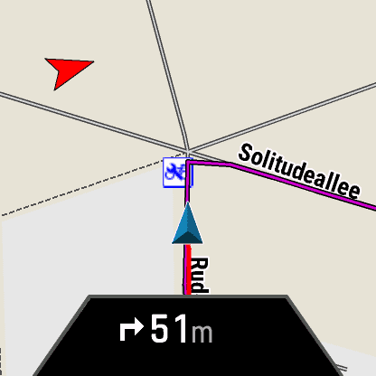
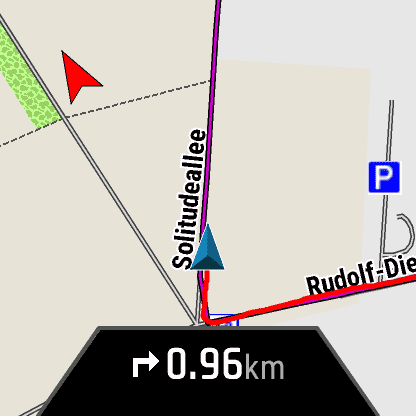
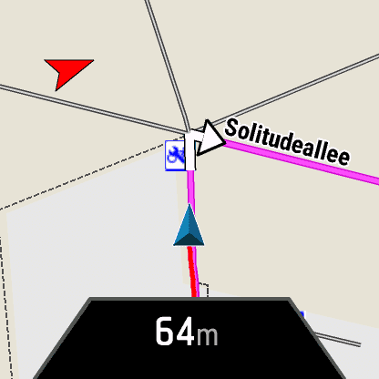
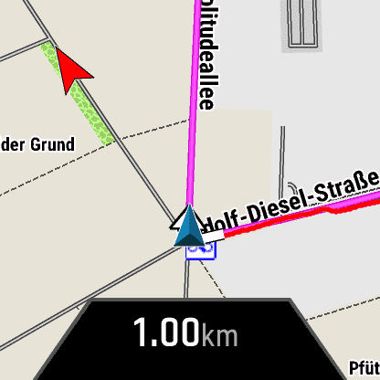

Navigation mit der Garmin 7X und Epix2
======================================

Hier eine Sache die mich stört: Die 7X (... und auch die Epix2)
beherrscht ja Kartennavigation mit Abbiegehinweisen.
Wie sich rausstellt, gibt es dafür zwei unterschiedliche
Darstellungen. Erstmal die "übliche":

Vor der Abbiegung sieht man unten die Entfernung (51m) und die Richtungsänderung (nach rechts).
Nach der Abbiegung sieht man die Entfernung zur nächsten Abbiegung (0.96km) und auch die Richtung (rechts).
Da weiß ich dann also, dass ich mich vermutlich am besten auf der rechten Strassenseite bewege.

Jetzt die gleiche Stelle mit einem anderen Navigationsmodus (gleiche Uhr):

Diese Darstellung erhalte ich mit "Rundkurs/Roundtrip" auf der Uhr.

Mir gefällt:
- dass ich den Kurs besser erkennen kann - er ist "dicker" eingefärbt
- dass ich die Abzeigungen besser erkennen kann - ich sehe an der Karte mit dem Pfeil, dass ich ganz rechts muß und nicht nur leicht rechts

Mir gefällt NICHT:
- dass ich nach der Abzweigung nur die Entfernung bis zur nächsten Abzweigung sehe und nicht mehr die Richtung (rechts-links)

Idealerweise bekomme ich die Kartendarstellung vom "Rundkurs" und die "Einblendung" von der Routen-Navigation. Weiß jemand, wie ich das schaffe?

Vielen Dank + lG, Uli
