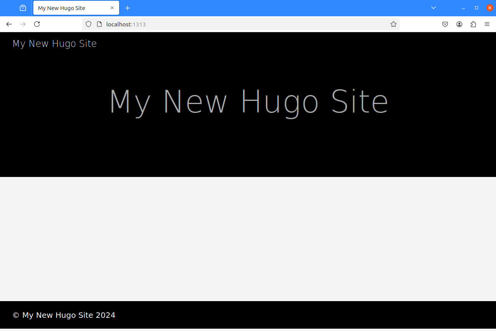
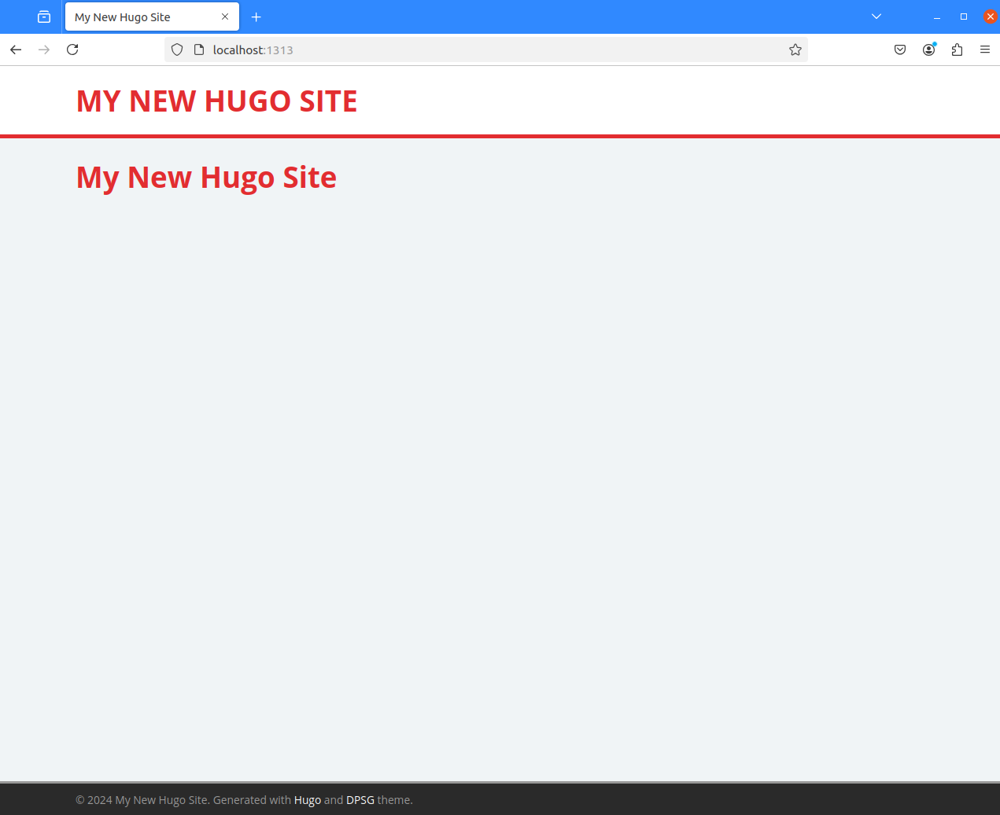

Erste Experimente mit Hugo
==========================

Installation
------------

Ich richte mich grob nach
[Hugo - Installation](https://gohugo.io/installation/linux/).
Mein Ziel ist die Installation der ExtendedEdition.

Vorabtests:

- Git: `git --version` -> git version 2.47.0
- Go: `go version` -> go version go1.23.2 linux/amd64
- Dart Sass: Lasse ich weg!

Hugo herunterladen:

- [Hugo - Downloads](https://github.com/gohugoio/hugo/releases/latest)
- [Hugo - 0.136.5](https://github.com/gohugoio/hugo/releases/download/v0.136.5/hugo_extended_0.136.5_linux-amd64.tar.gz)
- Danach: Virencheck etc - sieht alles gut aus!
- Auspacken, PATH erweitern, Test: `hugo version` -> hugo v0.136.5-46cc...

Erste Tests
-----------

```
uli@ulicsl:~/git/uli.heller.cool/hugo$ hugo version
hugo v0.136.5-46cccb021bc6425455f4eec093f5cc4a32f1d12c+extended linux/amd64 BuildDate=2024-10-24T12:26:27Z VendorInfo=gohugoio

uli@ulicsl:~/git/uli.heller.cool/hugo$ hugo new site quickstart
Congratulations! Your new Hugo site was created in /home/uli/git/uli.heller.cool/hugo/quickstart.
...

uli@ulicsl:~/git/uli.heller.cool/hugo$ git clone --depth=1 https://github.com/theNewDynamic/gohugo-theme-ananke.git quickstart/themes/ananke.clone
Klone nach 'quickstart/themes/ananke.clone'...
remote: Enumerating objects: 655, done.
...
Löse Unterschiede auf: 100% (54/54), fertig.

uli@ulicsl:~/git/uli.heller.cool/hugo$ mkdir quickstart/themes/ananke
uli@ulicsl:~/git/uli.heller.cool/hugo$ git archive --remote file://$(pwd)/quickstart/themes/ananke.clone main|(cd quickstart/themes/ananke && tar xf -)
uli@ulicsl:~/git/uli.heller.cool/hugo$ rm -rf quickstart/themes/ananke.clone

uli@ulicsl:~/git/uli.heller.cool/hugo$ echo "theme = 'ananke'" >>quickstart/hugo.toml

uli@ulicsl:~/git/uli.heller.cool/hugo$ hugo --source quickstart server
Watching for changes in /home/uli/git/uli.heller.cool/hugo/quickstart/{archetypes,assets,content,data,i18n,layouts,static,themes}
Watching for config changes in /home/uli/git/uli.heller.cool/hugo/quickstart/hugo.toml, /home/uli/git/uli.heller.cool/hugo/quickstart/themes/ananke/config/_default
...
Serving pages from disk
Running in Fast Render Mode. For full rebuilds on change: hugo server --disableFastRender
Web Server is available at http://localhost:1313/ (bind address 127.0.0.1) 
Press Ctrl+C to stop
```

Wenn ich danach den [angegebenen Link](http://localhost:1313/)
im Browser öffne, dann erscheint ein Grundgerüst einer Webseite.



Zusatzhinweise:

- Ohne "Theme" erscheint nur eine Fehlermeldung
- In der Anleitung [Hugo - Getting started - Quick start](https://gohugo.io/getting-started/quick-start/) wird das "Theme" als Git-Submodule eingespielt. Ich mach das per `git clone`!
- Leider unterstützt Github nicht direkt den Aufruf von `git archive ...`, deshalb der Umweg über `git clone ...`!

Aktivieren der Beispielkonfiguration:

```
cp quickstart/themes/ananke/exampleSite/config.toml quickstart/hugo.toml
# quickstart/hugo.toml: Zeile mit theme anpassen
hugo --source quickstart server
```

Danach sieht die Seite so aus:


Umstellung auf DPSG
-------------------

```
git clone --depth=1 https://github.com/pfadfinder-konstanz/hugo-dpsg quickstart/themes/hugo-dpsg.clone
mkdir quickstart/themes/hugo-dpsg
git archive --remote file://$(pwd)/quickstart/themes/hugo-dpsg.clone HEAD|(cd quickstart/themes/hugo-dpsg && tar xf -)
rm -rf quickstart/themes/hugo-dpsg.clone
sed -i -e "/^\s*theme\s*=/ d" quickstart/hugo.toml
echo "theme = 'hugo-dpsg'" >>quickstart/hugo.toml
hugo --source quickstart server
```

Danach sieht die Seite so aus:



Relativ schlicht!

Zusätzlich: "config.toml" aus DPSG einspielen

```
cp quickstart/themes/hugo-dpsg/exampleSite/config.toml quickstart/hugo.toml
hugo --source quickstart server
# ... bricht ab mit Fehlermeldungen -> schnell korrigiert, siehe Notizen
```

Mit den Korrekturen erhält man:


### Notizen

#### Kommandos

```
hugo version
hugo new site quickstart
git clone --depth=1 https://github.com/theNewDynamic/gohugo-theme-ananke.git quickstart/themes/ananke.clone
mkdir quickstart/themes/ananke
git archive --remote file://$(pwd)/quickstart/themes/ananke.clone main|(cd quickstart/themes/ananke && tar xf -)
rm -rf quickstart/themes/ananke.clone
echo "theme = 'ananke'" >>quickstart/hugo.toml
hugo --source quickstart server
```

#### Ausgaben

```
uli@ulicsl:~/git/uli.heller.cool/hugo$ hugo version
hugo v0.136.5-46cccb021bc6425455f4eec093f5cc4a32f1d12c+extended linux/amd64 BuildDate=2024-10-24T12:26:27Z VendorInfo=gohugoio
uli@ulicsl:~/git/uli.heller.cool/hugo$ hugo new site quickstart
Congratulations! Your new Hugo site was created in /home/uli/git/uli.heller.cool/hugo/quickstart.

Just a few more steps...

1. Change the current directory to /home/uli/git/uli.heller.cool/hugo/quickstart.
2. Create or install a theme:
   - Create a new theme with the command "hugo new theme <THEMENAME>"
   - Or, install a theme from https://themes.gohugo.io/
3. Edit hugo.toml, setting the "theme" property to the theme name.
4. Create new content with the command "hugo new content <SECTIONNAME>/<FILENAME>.<FORMAT>".
5. Start the embedded web server with the command "hugo server --buildDrafts".

See documentation at https://gohugo.io/.
uli@ulicsl:~/git/uli.heller.cool/hugo$ git clone --depth=1 https://github.com/theNewDynamic/gohugo-theme-ananke.git quickstart/themes/ananke.clone
Klone nach 'quickstart/themes/ananke.clone'...
remote: Enumerating objects: 655, done.
remote: Counting objects: 100% (655/655), done.
remote: Compressing objects: 100% (590/590), done.
remote: Total 655 (delta 54), reused 591 (delta 49), pack-reused 0 (from 0)
Empfange Objekte: 100% (655/655), 2.99 MiB | 7.28 MiB/s, fertig.
Löse Unterschiede auf: 100% (54/54), fertig.
uli@ulicsl:~/git/uli.heller.cool/hugo$ mkdir quickstart/themes/ananke
uli@ulicsl:~/git/uli.heller.cool/hugo$ git archive --remote file://$(pwd)/quickstart/themes/ananke.clone main|(cd quickstart/themes/ananke && tar xf -)
uli@ulicsl:~/git/uli.heller.cool/hugo$ rm -rf quickstart/themes/ananke.clone
uli@ulicsl:~/git/uli.heller.cool/hugo$ echo "theme = 'ananke'" >>quickstart/hugo.toml
uli@ulicsl:~/git/uli.heller.cool/hugo$ hugo --source quickstart server
Watching for changes in /home/uli/git/uli.heller.cool/hugo/quickstart/{archetypes,assets,content,data,i18n,layouts,static,themes}
Watching for config changes in /home/uli/git/uli.heller.cool/hugo/quickstart/hugo.toml, /home/uli/git/uli.heller.cool/hugo/quickstart/themes/ananke/config/_default
Start building sites … 
hugo v0.136.5-46cccb021bc6425455f4eec093f5cc4a32f1d12c+extended linux/amd64 BuildDate=2024-10-24T12:26:27Z VendorInfo=gohugoio


                   | EN  
-------------------+-----
  Pages            |  8  
  Paginator pages  |  0  
  Non-page files   |  0  
  Static files     |  1  
  Processed images |  0  
  Aliases          |  0  
  Cleaned          |  0  

Built in 63 ms
Environment: "development"
Serving pages from disk
Running in Fast Render Mode. For full rebuilds on change: hugo server --disableFastRender
Web Server is available at http://localhost:1313/ (bind address 127.0.0.1) 
Press Ctrl+C to stop
```

#### Probleme mit dpgs/config.toml

Nach `cp quickstart/themes/hugo-dpsg/exampleSite/config.toml quickstart/hugo.tom`
kann Hugo nicht mehr gestartet werden:

```
uli@ulicsl:~/git/github/uli-heller/uli.heller.cool/hugo$ hugo --source quickstart server
WARN  deprecated: site config key paginate was deprecated in Hugo v0.128.0 and will be removed in a future release. Use pagination.pagerSize instead.
Watching for changes in /home/uli/git/github/uli-heller/uli.heller.cool/hugo/quickstart/{archetypes,assets,content,data,i18n,layouts,static,themes}
Watching for config changes in /home/uli/git/github/uli-heller/uli.heller.cool/hugo/quickstart/hugo.toml
Start building sites … 
hugo v0.136.5-46cccb021bc6425455f4eec093f5cc4a32f1d12c+extended linux/amd64 BuildDate=2024-10-24T12:26:27Z VendorInfo=gohugoio

ERROR deprecated: .Site.IsMultiLingual was deprecated in Hugo v0.124.0 and will be removed in Hugo 0.137.0. Use hugo.IsMultilingual instead.
Built in 23 ms
Error: error building site: logged 1 error(s)
```

Korrektur:

```
diff --git a/hugo/quickstart/hugo.toml b/hugo/quickstart/hugo.toml
index e521dc6..4ea94a5 100644
--- a/hugo/quickstart/hugo.toml
+++ b/hugo/quickstart/hugo.toml
@@ -2,7 +2,7 @@ baseurl = "https://example.com"
 title = "Hugo DPSG"
 languageCode = "de"
 DefaultContentLanguage = "de"
-paginate = "10" # Number of posts per page
+pagination.pagerSize = "10" # Number of posts per page
 theme = "hugo-dpsg"
 
 [Params]
diff --git a/hugo/quickstart/themes/hugo-dpsg/layouts/partials/widgets/languages.html b/hugo/quickstart/themes/hugo-dpsg/layouts/partials/widgets/languages.html
index e54adb1..3c20ab1 100644
--- a/hugo/quickstart/themes/hugo-dpsg/layouts/partials/widgets/languages.html
+++ b/hugo/quickstart/themes/hugo-dpsg/layouts/partials/widgets/languages.html
@@ -1,5 +1,5 @@
 {{- $translations := .Site.Home.AllTranslations }}
-{{- if and .Site.IsMultiLingual (gt (len $translations) 0) }}
+{{- if and hugo.IsMultilingual (gt (len $translations) 0) }}
 <div class="widget-languages widget">
        <h4 class="widget__title">{{ T "languages_title" }}</h4>
        <div class="widget__content">
```

Links
-----

- [Hugo - Getting started - Quick start](https://gohugo.io/getting-started/quick-start/)
- [Hugo - Installation](https://gohugo.io/installation/linux/)
  - [Hugo - Downloads](https://github.com/gohugoio/hugo/releases/latest)
- Themes
  - [Ananke](https://themes.gohugo.io/themes/gohugo-theme-ananke/)
  - [DSGO](https://themes.gohugo.io/themes/hugo-dpsg/)
  
Historie
--------

- 2024-11-03 - Erste Version
