Routing-Verbesserungen mit Firmware 9.22
========================================

Eine Sache, die mich bei meinen Garmins etwas stört, ist die Tatsache, dass
ich auf der Kartendarstellung die Soll-Strecke teilweise recht schlecht
erkennen kann. Insbesondere bei Punkten, die mehrfach passiert werden,
ist nicht immer klar wie es nach der Kreuzung weitergeht. Mit Firmware 9.22
sind da einige Verbesserungen gemacht worden.

Ich habe dazu diese Test-Strecke geplant:

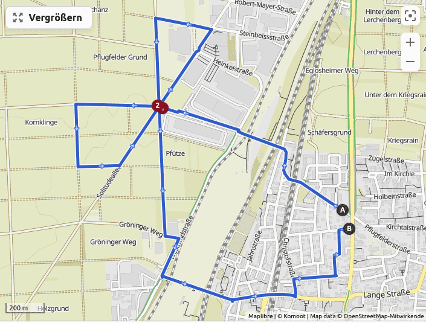

Der kritische Punkt ist die Kreuzung oben links. Diese hier nochmal im
Detail mit den geplanten Richtungsänderungen:

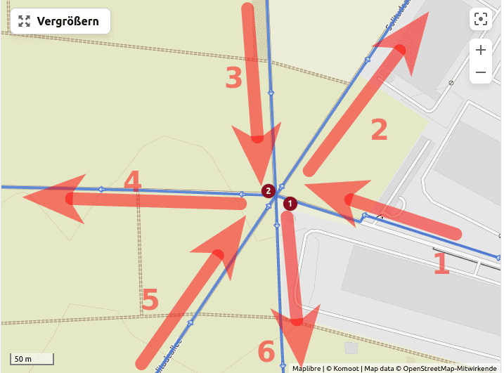

Die Strecke habe ich in meine beiden aktuellen Garmin-Uhren geladen:

- links: Epix2 mit Firmware-9.22
- rechts: Fenix 7X Sapphire mit Firmware-8.37

Ich bin die Strecke dann mit beiden Uhren abgelaufen.

Firmware-8.37 - Fenix 7X Sapphire
----------------------------------

Mit der Firmware-8.37 auf der Fenix 7X Sapphire sieht die kritische Kreuzung bei Näherungen
jeweils so aus:

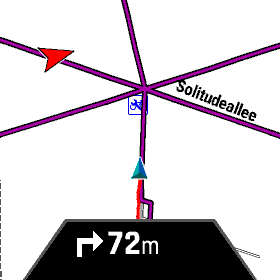

Bei der ersten Näherung sieht man die Kreuzung
mit allen einmündenden Wegen. Alle Wege liegen
auf der geplanten Route und sind deshalb
in der Farbe Magenta eingefärbt.

Die Soll-Strecke erkennt man nur "unten" am Pfeil -
es geht also nach rechts. Unklar ist, welcher der
rechten Wege genommen werden soll!

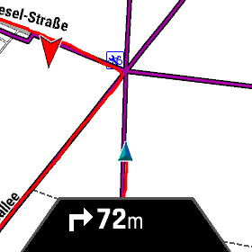

Die zweite Näherung sieht ähnlich aus wie die erste.
Einige Wege der Kreuzung sind rot eingefärbt, weil
ich die schon abgegangen bin. Es geht wieder nach rechts.

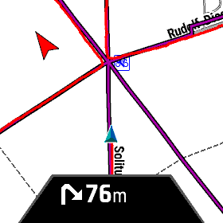

Bei der dritten Näherung sind 4 Wege rot eingefärbt.
Wieder geht es rechts weiter auf dem Magenta-Weg, den
ich noch nicht abgelaufen bin.

Firmware-9.22 - Epix2
---------------------

Mit der Firmware-9.22 auf der Epix2 sieht die kritische Kreuzung bei Näherungen
jeweils so aus:

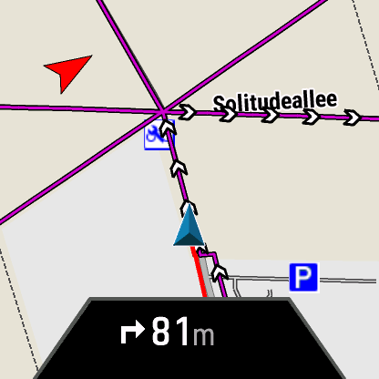

Bei der ersten Näherung sieht man wieder die Kreuzung
mit allen einmündenden Wegen. Alle Wege liegen
auf der geplanten Route und sind deshalb
in der Farbe Magenta eingefärbt.

Die Soll-Strecke erkennt man "unten" am Pfeil
und an den kleinen weißen Pfeilen in der Karte.
Es geht also nach rechts. Es ist klar, dass
"scharf rechts" gemeint ist!

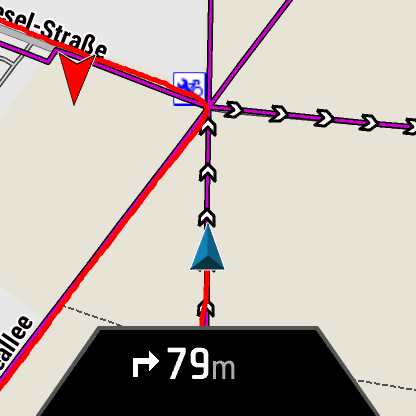

Bei der zweiten Näherung sieht man sehr gut:

- die bereits abgelaufenen Wege (rot)
- die noch nicht abgelaufenen Wege (magenta)
- die aktuell "anstehenden" Wege (magenta mit weißen Pfeilen)

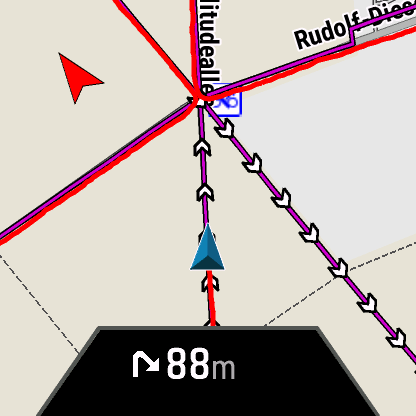

Die dritte Näherung wird ähnlich perfekt angezeigt wie
die zweite. Es ist zweifelsfrei klar, welcher Streckenteil
gerade ansteht.

Firmware-9.22 - Kurze Schleifen
-------------------------------

Die neue Routen-Darstellung kommt an ihre Grenzen, wenn die
Schleifen zu kurz sind.

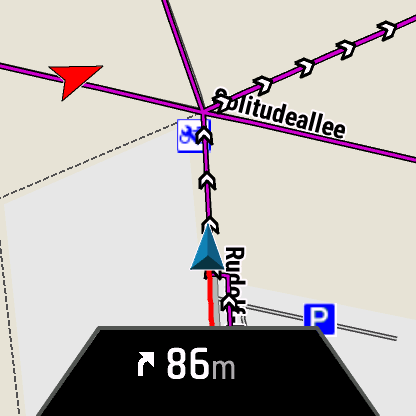

Bei der ersten Annäherung ist alles OK, die Darstellung ist perfekt.

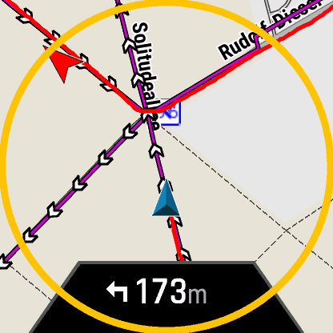

Grob 4km nach der ersten Annäherung erfolgt die zweite Annäherung.
Man sieht vorab bereits die (noch) irrelevanten Routen der dritten
Annäherung. Die Darstellung ist nicht sonderlich aufgschlussreich, vermutlich weil
die dritte Annäherung bereits 500m später erfolgt!

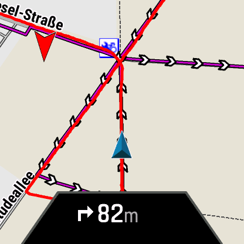

Nach grob 4.5km erfolgt die dritte Annäherung.
Man sieht auch noch die veralteten Routen der zweiten Annäherung.
