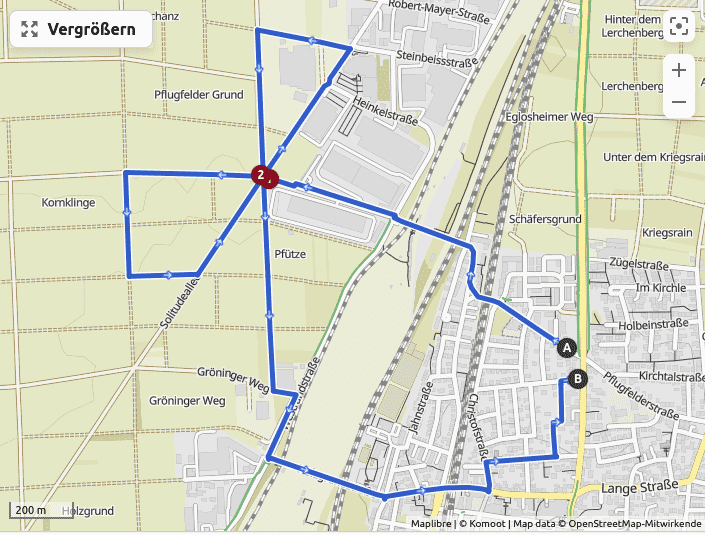

Routing-Verbesserungen mit Firmware 9.22
========================================

Eine Sache, die mich bei meinen Garmins etwas stört, ist die Tatsache, dass
ich auf der Kartendarstellung die Soll-Strecke teilweise recht schlecht
erkennen kann. Insbesondere bei Punkten, die mehrfach passiert werden,
ist nicht immer klar wie es nach der Kreuzung weitergeht. Mit Firmware 9.22
sind da einige Verbesserungen gemacht worden.

Ich habe dazu diese Test-Strecke geplant:

Der kritische Punkt ist die Kreuzung oben links. Diese hier nochmal im
Detail mit den geplanten Richtungsänderungen:

.... hier kommt noch mehr.