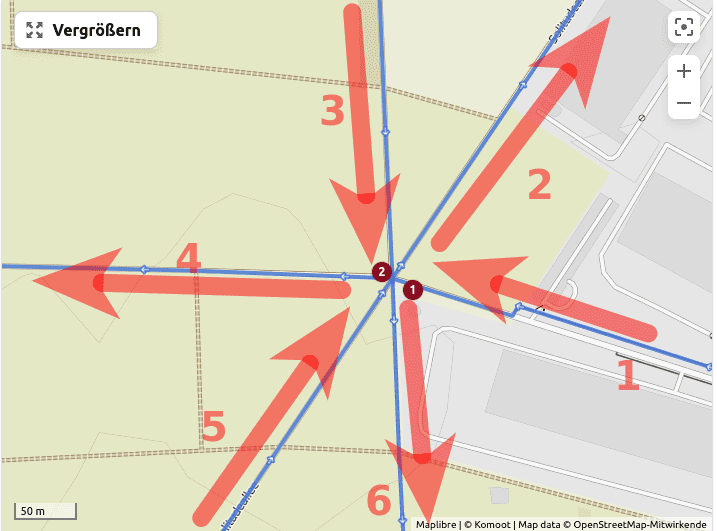
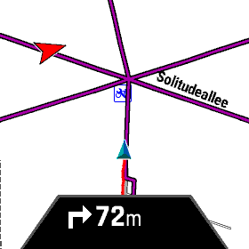
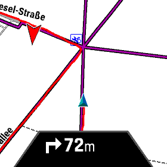
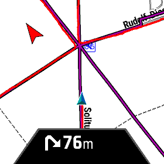
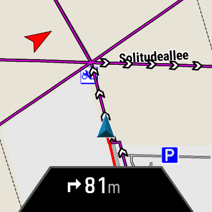
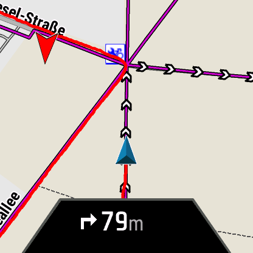
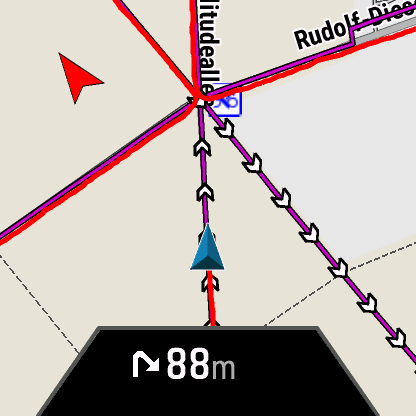

Routing-Verbesserungen mit Firmware 9.22
========================================

Eine Sache, die mich bei meinen Garmins etwas stört, ist die Tatsache, dass
ich auf der Kartendarstellung die Soll-Strecke teilweise recht schlecht
erkennen kann. Insbesondere bei Punkten, die mehrfach passiert werden,
ist nicht immer klar wie es nach der Kreuzung weitergeht. Mit Firmware 9.22
sind da einige Verbesserungen gemacht worden.

Ich habe dazu diese Test-Strecke geplant:

Der kritische Punkt ist die Kreuzung oben links. Diese hier nochmal im
Detail mit den geplanten Richtungsänderungen:

Die Strecke habe ich in meine beiden aktuellen Garmin-Uhren geladen:

- links: Epix2 mit Firmware-9.22
- rechts: Fenix 7X Sapphire mit Firmware-8.37

Ich bin die Strecke dann mit beiden Uhren abgelaufen.

Firmware-8.37 - Fenix 7X Sapphire
----------------------------------

Mit der Firmware-8.37 auf der Fenix 7X Sapphire sieht die kritische Kreuzung bei Näherungen
jeweils so aus:

Firmware-9.22 - Epix2
---------------------

Mit der Firmware-9.22 auf der Epix2 sieht die kritische Kreuzung bei Näherungen
jeweils so aus:

